### Java基础
#### 基础知识
##### [Java中String.intern()方法详解](https://blog.csdn.net/l243225530/article/details/49736611)
* 在jdk1.6中，intern()方法会把首次遇到的字符串实例复制到永久代中，返回的也是永久代中这个字符串实例的引用。而jdk1.7中的intern()实现不会再复制实例，只是在常量池中记录首次出现的实例引用。

#### 集合框架
##### java8中的hashmap
* Java8 对 HashMap 进行了一些修改，最大的不同就是利用了红黑树，所以其由 数组+链表+红黑树 组成。
* 引入红黑树的原因是：链表查询的时间复杂度为O(n)，为了降低这部分开销，Java8当链表元素超过了8个之后，会将链表转换为红黑树，因为红黑树查找的时间复杂度为O(logN)
* ava7 中使用 Entry 来代表每个 HashMap 中的数据节点，Java8 中使用 Node，基本没有区别，都是 key，value，hash 和 next 这四个属性，不过，Node 只能用于链表的情况，红黑树的情况需要使用 TreeNode。
* 我们根据数组元素中，第一个节点数据类型是 Node 还是 TreeNode 来判断该位置下是链表还是红黑树的。

##### [hashmap扩容为什么是2的幂](https://blog.csdn.net/wanghuan220323/article/details/78242449/)
* hashmap中获取桶的地址使用的indexfor()的原理是`hash&(lenth-1)`
* 计算机里面位运算是基本运算，位运算的效率是远远高于取余%运算的。当lenth为2的幂时，lenth-1的二进制恒定为全是1，此时hash值和lenth-1进行按位与得到的就是%后的的余数。

##### ArrayList
* 实现RanddomAccess接口（标记接口），基于数据实现，数据默认大小为10，支持随机访问
* 添加元素时使用`ensureCapacityInternal()`方法保证容量，如果不够是，使用`grow()`方法进行扩容，新容量的大小为`oldCapacity+(oldCapacity>>1)`,也就是就容量的1.5倍。扩容操作需要调用`Arrays.copyOf()`把原数据整个复制到新数组中，这个操作代价极高，因此**最好在创建ArrayList对象时就指定大改的容量大小，减少扩容操作的次数**。
* 删除操作需要调用`Arrays.copyOf()`将index+1后面的元素都复制到index上，该操作的为时间复杂度为O(N),因此ArrayList删除元素的代价非常高。
* Fail-Fast:modCount 用来记录 ArrayList 结构发生变化的次数。结构发生变化是指添加或者删除至少一个元素的所有操作，或者是调整内部数组的大小，仅仅只是设置元素的值(set()并没有modCount++)不算结构发生变化
> 注意：这里异常的抛出条件是检测到 modCount！=expectedmodCount 这个条件。如果集合发生变化时修改modCount值刚好又设置为了expectedmodCount值，则异常不会抛出。因此，不能依赖于这个异常是否抛出而进行并发操作的编程，这个异常只建议用于检测并发修改的bug。

#### Vector
* Vector实现与ArrayList类似，但是使用了Synchronized进行同步。
* 与ArrayList比较
	* vector是同步的，因此开销比ArrayList大，速度更慢。
	* vector每次扩容请求其大小的2倍空间，而ArrayList是1.5倍。

##### LinkedList
* 基于双向链表实现，使用Node存储链表节点信息
* 与ArrayList的比较
	1. ArrayList基于动态数组，LinkedList基于双向链表
	2. ArrayList支持随机访问，LinkedList不支持
	3. LinkedList在任意位置删除元素更快。

##### [LinkedHashMap](https://github.com/CyC2018/CS-Notes/blob/master/notes/Java%20%E5%AE%B9%E5%99%A8.md#linkedhashmap)
* 继承自HashMap,因此和HashMap一样具有快速查找特性。
* 内部维护了一个双向链表，用来维护插入顺序或者LRU顺序。
> LRU（Least recently used，最近最少使用）算法根据数据的历史访问记录来进行淘汰数据，其核心思想是“如果数据最近被访问过，那么将来被访问的几率也更高”。
> https://blog.csdn.net/wangxilong1991/article/details/70172302
> https://baike.baidu.com/item/LRU/1269842?fr=aladdin
* accessOrder 决定了顺序，默认为 false，此时维护的是插入顺序。
* LinkedHashMap 最重要的是以下用于维护顺序的函数，它们会在 put、get 等方法中调用。
```
void afterNodeAccess(Node<K,V> p) { }
void afterNodeInsertion(boolean evict) { }
```
* afterNodeAccess():当一个节点被访问时，如果 accessOrder 为 true，则会将该节点移到链表尾部。也就是说指定为 LRU 顺序之后，在每次访问一个节点时，会将这个节点移到链表尾部，保证链表尾部是最近访问的节点，那么链表首部就是最近最久未使用的节点。
* afterNodeInsertion():在 put 等操作之后执行，当 removeEldestEntry() 方法返回 true 时会移除最晚的节点，也就是链表首部节点 first。
evict 只有在构建 Map 的时候才为 false，在这里为 true。
removeEldestEntry() 默认为 false，如果需要让它为 true，需要继承 LinkedHashMap 并且覆盖这个方法的实现，这在实现 LRU 的缓存中特别有用，通过移除最近最久未使用的节点，从而保证缓存空间足够，并且缓存的数据都是热点数据。

##### WeakHashMap
* WeakHashMap的Entry继承自WeakReference，被 WeakReference 关联的对象在下一次垃圾回收时会被回收。
* Tomcat 中的 ConcurrentCache 使用了 WeakHashMap 来实现缓存功能。

#### 并发与多线程
> https://github.com/CyC2018/CS-Notes/blob/master/notes/Java%20%E5%B9%B6%E5%8F%91.md#semaphore

> [java中的notify和notifyAll有什么区别？](https://www.zhihu.com/question/37601861)
> 

##### 中断
* 通过调用一个线程的 interrupt() 来中断该线程，如果该线程处于阻塞、限期等待或者无限期等待状态，那么就会抛出 InterruptedException，从而提前结束该线程。但是**不能中断 I/O 阻塞和 synchronized 锁阻塞**。
* 如果一个线程的 run() 方法执行一个无限循环，并且没有执行 sleep() 等会抛出 InterruptedException 的操作，那么调用线程的 interrupt() 方法就无法使线程提前结束。
但是调用 interrupt() 方法会设置线程的中断标记，此时调用 interrupted() 方法会返回 true。因此可以在循环体中使用 interrupted() 方法来判断线程是否处于中断状态，从而提前结束线程。

* 调用 Executor 的 shutdown() 方法会等待线程都执行完毕之后再关闭，但是如果调用的是 shutdownNow() 方法，则相当于调用每个线程的 interrupt() 方法。

##### 锁
* ReentrantLock和synchronized的区别
	1. **锁的实现**：synchronized是jvm实现的，而ReentrantLock是jdk实现
	2. **性能**： 新版本 Java 对 synchronized 进行了很多优化，例如自旋锁等，synchronized 与 ReentrantLock 大致相同。
	3. **等待可中断**：当持有锁的线程长期不释放锁的时候，正在等待的线程可以选择放弃等待，改为处理其他事情。ReentrantLock 以使用thread.interript()中断，而 synchronized 不行。
	4. **公平锁**:synchronized 中的锁是非公平的，ReentrantLock 默认情况下也是非公平的，但是也可以是公平的。
	5. **锁绑定多个条件**:一个 ReentrantLock 可以同时绑定多个 Condition 对象。
> 除非需要使用 ReentrantLock 的高级功能，否则优先使用 synchronized。这是因为 synchronized 是 JVM 实现的一种锁机制，JVM 原生地支持它，而 ReentrantLock 不是所有的 JDK 版本都支持。并且使用 synchronized 不用担心没有释放锁而导致死锁问题，因为 JVM 会确保锁的释放。

* wait() 和 sleep() 的区别
	1. wait() 是 Object 的方法，而 sleep() 是 Thread 的静态方法；
	2. wait() 会释放锁，sleep() 不会。

##### 线程池
##### [线程池的创建分析](https://www.jianshu.com/p/adbf37ef77bb）
* Executor框架：Executor是一套线程池管理框架，接口里只有一个方法execute，执行Runnable任务。ExecutorService接口扩展了Executor，添加了线程生命周期的管理，提供任务终止、返回任务结果等方法。AbstractExecutorService实现了ExecutorService，提供例如submit方法的默认实现逻辑。ThreadPoolExecutor继承； AbstractExecutorService
* [ThreadPoolExecutor](https://www.cnblogs.com/sachen/p/7401959.html
)预设了一些已经定制好的线程池，由**Executors里的工厂方法**创建。
	1. **newFixedThreadPool**:newFixedThreadPool的corePoolSize和maximumPoolSize都设置为传入的固定数量，keepAliveTim设置为0。线程池创建后，线程数量将会固定不变，适合需要线程很稳定的场合。
	2. **newSingleThreadExector**:newSingleThreadExecutor是线程数量固定为1的newFixedThreadPool版本，保证池内的任务串行。返回的是**FinalizableDelegatedExecutorService**。FinalizableDelegatedExecutorService继承了**DelegatedExecutorService**，仅仅在gc时增加关闭线程池的操作。DelegatedExecutorService包装了ExecutorService，使其只暴露出ExecutorService的方法，因此不能再配置线程池的参数。本来，线程池创建的参数是可以调整的，ThreadPoolExecutor提供了set方法。使用newSingleThreadExecutor目的是生成单线程串行的线程池，如果还能配置线程池大小，那就没意思了。
	3. **newCachedThreadPool**:newCachedThreadPool生成一个会缓存的线程池，线程数量可以从0到Integer.MAX_VALUE，超时时间为1分钟。线程池用起来的效果是：如果有空闲线程，会复用线程；如果没有空闲线程，会新建线程；如果线程空闲超过1分钟，将会被回收。
	4. **newScheduledThreadPool**:newScheduledThreadPool将会创建一个可定时执行任务的线程池。
* 等待队列：ThreadPoolExecutor提供一个阻塞队列来保存因线程不足而等待的Runnable任务，这就是BlockingQueue。JDK提供的常用的BlockingQueue的方式有
	1. ArrayBlockingQueue：数组结构的阻塞队列
	2. LinkedBlockingQueue：链表结构的阻塞队列
	3. PriorityBlockingQueue：有优先级的阻塞队列，优先级是由传入的Comparator接口实现的
	4. SynchronousQueue：不会存储元素的阻塞队列
* newFixedThreadPool和newSingleThreadExecutor在默认情况下使用一个无界的LinkedBlockingQueue。要注意的是，如果任务一直提交，但线程池又不能及时处理，等待队列将会无限制地加长，系统资源总会有消耗殆尽的一刻。所以，**推荐使用有界的等待队列，避免资源耗尽**。
* newCachedThreadPool使用的SynchronousQueue十分有趣，看名称是个队列，但它却不能存储元素。要将一个任务放进队列，必须有另一个线程去接收这个任务，一个进就有一个出，队列不会存储任何东西。因此，SynchronousQueue是一种移交机制，不能算是队列。newCachedThreadPool生成的是一个没有上限的线程池，理论上提交多少任务都可以，使用SynchronousQueue作为等待队列正合适。
* 饱和策略：当有界的等待队列满了之后，就需要用到饱和策略去处理，ThreadPoolExecutor的饱和策略通过传入RejectedExecutionHandler来实现。如果没有为构造函数传入，将会使用默认的defaultHandler。
	1. AbortPolicy是默认的实现，直接抛出一个RejectedExecutionException异常，让调用者自己处理
	2. DiscardPolicy的rejectedExecution直接是空方法，什么也不干。如果队列满了，后续的任务都抛弃掉。
	3. DiscardOldestPolicy会将等待队列里最旧的任务踢走，让新任务得以执行。
	4. 最后一种饱和策略是CallerRunsPolicy，它既不抛弃新任务，也不抛弃旧任务，而是直接在当前线程运行这个任务。当前线程一般就是主线程啊，让主线程运行任务，说不定就阻塞了。如果不是想清楚了整套方案，还是少用这种策略为妙。
* ThreadFactory:每当线程池需要创建一个新线程，都是通过线程工厂获取。如果不为ThreadPoolExecutor设定一个线程工厂，就会使用默认的defaultThreadFactory

##### [线程池执行原理](https://www.jianshu.com/p/f62a3f452869)
> https://www.cnblogs.com/dolphin0520/p/3932921.html

* 两个贯穿线程代码的参数，线程池用一个32位的int来同时保存runState和workerCount，其中高3位是runState，其余29位是workerCount。代码中会反复使用runStateOf和workerCountOf来获取runState和workerCount。
	1. runState:线程池运行状态
	2. workCount:工作线程的数量
* 线程池状态
	1. RUNNING：可接收新任务，可执行等待队列里的任务
	2. SHUTDOWN：不可接收新任务，可执行等待队列里的任务
	3. STOP：不可接收新任务，不可执行等待队列里的任务，并且尝试终止所有在运行任务
	4. TIDYING：所有任务已经终止，执行terminated()
	5. TERMINATED：terminated()执行完成
* **worker**:线程池是由Worker类负责执行任务，Worker继承了AbstractQueuedSynchronizer
* 任务提交给线程池之后的处理策略
	1. 如果当前线程池中的线程数目小于corePoolSize，则每来一个任务，就会创建一个线程去执行这个任务；
	2. 如果当前线程池中的线程数目>=corePoolSize，则每来一个任务，会尝试将其添加到任务缓存队列当中，若添加成功，则该任务会等待空闲线程将其取出去执行；若添加失败（一般来说是任务缓存队列已满），则会尝试创建新的线程去执行这个任务；
	3. 如果当前线程池中的线程数目达到maximumPoolSize，则会采取任务拒绝策略进行处理；
	4. 如果线程池中的线程数量大于 corePoolSize时，如果某线程空闲时间超过keepAliveTime，线程将被终止，直至线程池中的线程数目不大于corePoolSize；如果允许为核心池中的线程设置存活时间，那么核心池中的线程空闲时间超过keepAliveTime，线程也会被终止。


##### 并发容器
###### BlockingQueue
java.util.concurrent.BlockingQueue 接口有以下阻塞队列的实现：
1. **FIFO 队列 **:LinkedBlockingQueue、ArrayBlockingQueue（固定长度）
2. **优先级队列**:PriorityBlockingQueue
* 提供了阻塞的**take()** 和**put()**方法：如果队列为空 take() 将阻塞，直到队列中有内容；如果队列为满 put() 将阻塞，直到队列有空闲位置。

###### copyOnWriteArrayList
> http://www.cnblogs.com/skywang12345/p/3498483.html

* CopyOnWriteArrayList相当于线程安全的ArrayList，它实现了List接口

* copyOnWriteArrayList使用的是**ReentrantLock**

* **CopyOnWriteArrayList的“动态数组”机制**:它内部有个“volatile数组”(array)来保持数据。在“添加/修改/删除”数据时，都会新建一个数组，并将更新后的数据拷贝到新建的数组中，最后再将该数组赋值给“volatile数组”。这就是它叫做CopyOnWriteArrayList的原因！CopyOnWriteArrayList就是通过这种方式实现的动态数组；不过正由于它在“添加/修改/删除”数据时，都会新建数组，所以涉及到修改数据的操作，CopyOnWriteArrayList效率很
低；但是单单只是进行遍历查找的话，效率比较高。
* **CopyOnWriteArrayList的“线程安全”机制**:通过volatile和互斥锁来实现
	1. CopyOnWriteArrayList是通过“volatile数组”来保存数据的。一个线程读取volatile数组时，总能看到其它线程对该volatile变量最后的写入；就这样，通过volatile提供了“读取到的数据总是最新的”这个机制的
	2.  CopyOnWriteArrayList通过互斥锁来保护数据。在“添加/修改/删除”数据时，会先“获取互斥锁”，再修改完毕之后，先将数据更新到“volatile数组”中，然后再“释放互斥锁”；这样，就达到了保护数据的目的。

* copyOnWrite的iterator()会返回COWIterator对象。COWIterator实现了ListIterator接口.COWIterator不支持修改元素的操作。例如，对于remove(),set(),add()等操作，COWIterator都会抛出异常！
另外，需要提到的一点是，CopyOnWriteArrayList返回迭代器不会抛出ConcurrentModificationException异常，即它不是fail-fast机制的！
* opyOnWriteArrayList 在写操作的同时允许读操作，大大提高了读操作的性能，因此很适合**读多写少**的应用场景。
* CopyOnWriteArrayList 的缺陷：
	*  内存占用：在写操作时需要复制一个新的数组，使得内存占用为原来的两倍左右；
	*  数据不一致：读操作不能读取实时性的数据，因为部分写操作的数据还未同步到读数组中。
* 所以 **CopyOnWriteArrayList 不适合内存敏感以及对实时性要求很高的场景。如果对实时性要求很高，可以是用ReentrantReadWriteLock对读写进行分别加锁**

###### CopyOnWriteArraySet
* CopyOnWriteArraySet是线程安全的无序集合，可以将它理解为线程安全的HashSet。
* CopyOnWriteArraySet和HashSet虽然都继承于共同的父类AbstractSet；但是，**HashSet是通过“散列表(HashMap)”实现的**，而**CopyOnWriteArraySet则是通过“动态数组(CopyOnWriteArrayList)”实现的，并不是散列表**。
* CopyOnWriteArraySet的“线程安全”机制，和CopyOnWriteArrayList一样，是通过**volatile和互斥锁**来实现的。CopyOnWriteArraySet包含CopyOnWriteArrayList对象，它是通过CopyOnWriteArrayList实现的。而CopyOnWriteArrayList本质是个动态数组队列，
所以CopyOnWriteArraySet相当于通过通过动态数组实现的“集合”！ CopyOnWriteArrayList中允许有重复的元素；但是，CopyOnWriteArraySet是一个集合，所以它不能有重复集合。因此，CopyOnWriteArrayList额外提供了addIfAbsent()和addAllAbsent()这两个添加元素的API，通过这些API来添加元素时，只有当元素不存在时才执行添加操作！

###### ConcurrentHashMap
* 　ConcurrentHashMap是线程安全的哈希表，它是通过“**锁分段**”来保证线程安全的。ConcurrentHashMap将哈希表分成许多片段(Segment)，每一个片段除了保存哈希表之外，本质上也是一个“可重入的互斥锁”(ReentrantLock)。
* 　对同一个片段的访问，是互斥的；但是，对于不同片段的访问，却是可以同步进行的。
* 　原理和数据结构
	* ConcurrentHashMap继承于AbstractMap抽象类。
	* Segment是ConcurrentHashMap中的内部类，它就是ConcurrentHashMap中的“锁分段”对应的存储结构。ConcurrentHashMap与Segment是组合关系，1个ConcurrentHashMap对象包含若干个Segment对象。在代码中，这表现为ConcurrentHashMap类中存在“Segment数组”成员。
	* Segment类继承于ReentrantLock类，所以**Segment本质上是一个可重入的互斥锁**。
	* HashEntry也是ConcurrentHashMap的内部类，是单向链表节点，存储着key-value键值对。Segment与HashEntry是组合关系，Segment类中存在“HashEntry数组”成员，“HashEntry数组”中的每个HashEntry就是一个单向链表。
* concurrencyLevel：并行级别、并发数、Segment 数，怎么翻译不重要，理解它。默认是 16，也就是说 ConcurrentHashMap 有 16 个 Segments，所以理论上，这个时候，最多可以同时支持 16 个线程并发写，只要它们的操作分别分布在不同的 Segment 上。这个值可以在初始化的时候设置为其他值，但是一旦初始化以后，它是不可以扩容的。
* **jdk 1.8 取消了基于 Segment 的分段锁思想，改用 CAS + 
*  控制并发操作**，在某些方面提升了性能。并且追随 1.8 版本的 HashMap 底层实现，使用数组+链表+红黑树进行数据存储。

##### ConcurrentSkipListMap
* ConcurrentSkipListMap可以看做是线程安全的TreeMap，它们虽然都是有序的哈希表。但是ConcurrentSkipListMap是通过跳表实现的，TreeMap是通过红黑树实现的。
* 跳表(Skip List)，它是平衡树的一种替代的数据结构，但是和红黑树不相同的是，跳表对于树的平衡的实现是基于一种随机化的算法的，这样也就是说跳表的插入和删除的工作是比较简单的。
* ConcurrentSkipListMap的数据结构
	1. ConcurrentSkipListMap继承于AbstractMap类
	2.  Index是ConcurrentSkipListMap的内部类，它与“跳表中的索引相对应”。HeadIndex继承于Index，ConcurrentSkipListMap中含有一个HeadIndex的对象head，head是“跳表的表头”。
	3.   Index是跳表中的索引，它包含“右索引的指针(right)”，“下索引的指针(down)”和“哈希表节点node”。node是Node的对象，Node也是ConcurrentSkipListMap中的内部类。
* ConcurrentSkipListMap线程安全的原因是，在一个死循环中判断当前获取值与之前获取值是否相等，不相等就跳出循环重新获取。

##### ConcurrentSkipListSet
* ConcurrentSkipListSet可以看做是线程安全的TreeSet,他们都是线程安全的。但是，ConcurrentSkipListSet是通过ConcurrentSkipListMap实现的，TreeSet是通过TreeMap实现的
* 原理及数据结构：
	1. ConcurrentSkipListSet继承于AbstractSet。因此，它本质上是一个集合
	2. ConcurrentSkipListSet实现了NavigableSet接口。因此，ConcurrentSkipListSet是一个有序的集合。
	3. ConcurrentSkipListSet是通过ConcurrentSkipListMap实现的。它包含一个ConcurrentNavigableMap对象m，而m对象实际上是ConcurrentNavigableMap的实现类ConcurrentSkipListMap的实例。ConcurrentSkipListMap中的元素是key-value键值对；而ConcurrentSkipListSet是集合，它只用到了ConcurrentSkipListMap中的key

##### ArrayBlockingQueue
* ArrayBlockingQueue是数组实现的**线程安全的有界的阻塞队列**(FIFO)
* 原理与数据结构
	1. ArrayBlockingQueue继承于AbstractQueue，并且它实现了BlockingQueue接口
	2. ArrayBlockingQueue内部是通过Object[]数组保存数据的，也就是说ArrayBlockingQueue本质上是通过数组实现的。ArrayBlockingQueue的大小，即数组的容量是创建ArrayBlockingQueue时指定的。
	3. ArrayBlockingQueue与ReentrantLock是组合关系，ArrayBlockingQueue中包含一个ReentrantLock对象(lock)。ArrayBlockingQueue就是根据该互斥锁实现“多线程对竞争资源的互斥访问”。ArrayBlockingQueue默认使用非公平锁。
	4. ArrayBlockingQueue与Condition是组合关系，ArrayBlockingQueue中包含两个Condition对象(notEmpty和notFull)。而且，Condition又依赖于ArrayBlockingQueue而存在，通过Condition可以实现对ArrayBlockingQueue的更精确的访问 -- (01)若某线程(线程A)要取数据时，数组正好为空，则该线程会执行notEmpty.await()进行等待；当其它某个线程(线程B)向数组中插入了数据之后，会调用notEmpty.signal()唤醒“notEmpty上的等待线程”。此时，线程A会被唤醒从而得以继续运行。(02)若某线程(线程H)要插入数据时，数组已满，则该线程会它执行notFull.await()进行等待；当其它某个线程(线程I)取出数据之后，会调用notFull.signal()唤醒“notFull上的等待线程”。此时，线程H就会被唤醒从而得以继续运行。

##### LinkedBlockingQueue
* LinkedBlockingQueue是一个单向链表实现的阻塞队列。该队列按 FIFO（先进先出）排序元素。此外，LinkedBlockingQueue还是可选容量的(防止过度膨胀)，即可以指定队列的容量。如果不指定，默认容量大小等于Integer.MAX_VALUE。
* 原理和数据结构
	1.  LinkedBlockingQueue继承于AbstractQueue，它本质上是一个FIFO(先进先出)的队列。
	2.  LinkedBlockingQueue实现了BlockingQueue接口，它支持多线程并发。当多线程竞争同一个资源时，某线程获取到该资源之后，其它线程需要阻塞等待。
	3.  LinkedBlockingQueue是通过单链表实现的。putLock是插入锁，takeLock是取出锁；notEmpty是“非空条件”，notFull是“未满条件”。通过它们对链表进行并发控制。LinkedBlockingQueue在实现“多线程对竞争资源的互斥访问”时，对于“插入”和“取出(删除)”操作分别使用了不同的锁。对于插入操作，通过“插入锁putLock”进行同步；对于取出操作，通过“取出锁takeLock”进行同步。此外，插入锁putLock和“非满条件notFull”相关联，取出锁takeLock和“非空条件notEmpty”相关联。通过notFull和notEmpty更细腻的控制锁。

##### LinkedBlockingDeque
* LinkedBlockingDeque是双向链表实现的双向并发阻塞队列。该阻塞队列同时支持FIFO和FILO两种操作方式，即可以从队列的头和尾同时操作(插入/删除)；并且，该阻塞队列是支持线程安全。此外，LinkedBlockingDeque还是可选容量的(防止过度膨胀)，即可以指定队列的容量。如果不指定，默认容量大小等于Integer.MAX_VALUE。
* 原理及数据结构
	1. LinkedBlockingDeque继承于AbstractQueue，它本质上是一个支持FIFO和FILO的双向的队列。
	2. LinkedBlockingDeque实现了BlockingDeque接口，它支持多线程并发。当多线程竞争同一个资源时，某线程获取到该资源之后，其它线程需要阻塞等待。
	3. LinkedBlockingDeque是通过双向链表实现的。
	4. lock是控制对LinkedBlockingDeque的互斥锁，当多个线程竞争同时访问LinkedBlockingDeque时，某线程获取到了互斥锁lock，其它线程则需要阻塞等待，直到该线程释放lock，其它线程才有机会获取lock从而获取cpu执行权。
	5. notEmpty和notFull分别是“非空条件”和“未满条件”。通过它们能够更加细腻进行并发控制。

##### ConcurrentLinkedQueue
* ConcurrentLinkedQueue是线程安全的队列,它是一个基于链接节点的无界线程安全队列，按照 FIFO（先进先出）原则对元素进行排序。队列元素中不可以放置null元素（内部实现的特殊节点除外）。
* 原理和数据结构
	1. ConcurrentLinkedQueue继承于AbstractQueue。
	2. ConcurrentLinkedQueue内部是通过链表来实现的。它同时包含链表的头节点head和尾节点tail。
	3. ConcurrentLinkedQueue的链表Node中的next的类型是volatile，而且链表数据item的类型也是volatile。

##### forkjoin
* 主要用于并行计算中，和 MapReduce 原理类似，都是把大的计算任务拆分成多个小任务并行计算。
* ForkJoin 使用 ForkJoinPool 来启动，它是一个特殊的线程池，线程数量取决于 CPU 核数。
* ForkJoinPool 实现了工作窃取算法来提高 CPU 的利用率。每个线程都维护了一个双端队列，用来存储需要执行的任务。工作窃取算法允许空闲的线程从其它线程的双端队列中窃取一个任务来执行。窃取的任务必须是最晚的任务，避免和队列所属线程发生竞争。

##### java内存模型
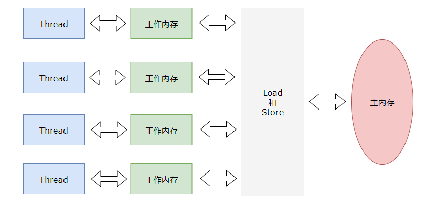

>[内存模型三大特性](https://github.com/CyC2018/CS-Notes/blob/master/notes/Java%20%E5%B9%B6%E5%8F%91.md#%E5%86%85%E5%AD%98%E6%A8%A1%E5%9E%8B%E4%B8%89%E5%A4%A7%E7%89%B9%E6%80%A7)

###### 先行发生原则
1.	**单一线程原则**：在一个线程内，在程序前面的操作先行发生于后面的操作
2.	**管程锁定原则**：一个unlock操作先行发生与后面对同一个锁的lock操作。
3.	**volatile变量规则**：对一个volatile变量的写操作先行发生于后面对着变量的读操作。
4.	**线程启动原则**：Thread对象的start()方法调用先行发生于此线程的每一个动作。
5.	**线程加入规则**：Thread对象的结束先行发生于join()方法发挥
6.	**线程中断原则**：对线程interrupt()方法的调用先行发生于被中断线程的代码检测到中断事件的发生，可以通过interrupted()方法检测到是否有中断发生。
7.	**对象终结规则**：一个对象的初始化完成（构造函数执行结束）先行发生于它的finalize()方法的开始
8.	**传递性**：如果操作A先行发生于操作B，操作B先行发生与操作C，那么操作A先行发生与操作C。

###### [synchronized原理](https://blog.csdn.net/javazejian/article/details/72828483)
* 重量级锁也就是通常说synchronized的对象锁，锁标识位为10，其中指针指向的是monitor对象（也称为管程或监视器锁）的起始地址。每个对象都存在着一个 monitor 与之关联，对象与其 monitor 之间的关系有存在多种实现方式，如monitor可以与对象一起创建销毁或当线程试图获取对象锁时自动生成，但当一个 monitor 被某个线程持有后，它便处于锁定状态。在Java虚拟机(HotSpot)中，monitor是由ObjectMonitor实现的，数据结构位于HotSpot虚拟机源码ObjectMonitor.hpp文件，C++实现。
* ObjectMonitor中有两个队列，_WaitSet 和 _EntryList，用来保存ObjectWaiter对象列表( 每个等待锁的线程都会被封装成ObjectWaiter对象)，_owner指向持有ObjectMonitor对象的线程，当多个线程同时访问一段同步代码时，首先会进入 _EntryList 集合，当线程获取到对象的monitor 后进入 _Owner 区域并把monitor中的owner变量设置为当前线程同时monitor中的计数器count加1，若线程调用 wait() 方法，将释放当前持有的monitor，owner变量恢复为null，count自减1，同时该线程进入 WaitSe t集合中等待被唤醒。若当前线程执行完毕也将释放monitor(锁)并复位变量的值，以便其他线程进入获取monitor(锁)。
* 同步语句块的实现使用的是monitorenter 和 monitorexit 指令
* synchronized修饰的方法并没有monitorenter指令和monitorexit指令，取得代之的确实是ACC_SYNCHRONIZED标识，该标识指明了该方法是一个同步方法，JVM通过该ACC_SYNCHRONIZED访问标志来辨别一个方法是否声明为同步方法，从而执行相应的同步调用。

###### [ReentrantLock实现原理](https://www.jianshu.com/p/fe027772e156)
* AQS即是AbstractQueuedSynchronizer，一个用来构建锁和同步工具的框架，包括常用的ReentrantLock、CountDownLatch、Semaphore等。
* AQS没有锁之类的概念，它有个state变量，是个int类型，在不同场合有着不同含义。(可以认为是锁）。state为0时表锁没有被占用，reentrantLock是可重入锁，获取和每次重入时都会对state加1，释放（unlock)时让state减1，知道0时将独占线程变量设置为空，返回标记是否彻底释放锁。
* AQS围绕state提供两种基本操作“获取”和“释放”，有条双向队列(**从源码来看，AQS类中有个内部类Node,这个Node有prev和next指针，并且标记了是独占还是共享的，看起来是个链表**）存放阻塞的等待线程，并提供一系列判断和处理方法
* ReentrantLock的内部类Sync继承了AQS,分为公平锁FairSync和非公平锁NonfairSync。FairSync和NonfairSync都继承了Sync。
* AQS Node的头结点代表了获取锁的线程，进入等待队列的线程会别添加到队列的末尾。因为头结点是获取锁的过程，那么释放锁的过程就是将头结点移出队列，再通知后面的节点获取锁。
* nonfairTryAcquire和tryAcquire乍一看几乎一样，差异只是缺少调用hasQueuedPredecessors。这点体验出公平锁和非公平锁的不同，公平锁会关注队列里排队的情况，老老实实按照FIFO的次序；非公平锁只要有机会就抢占，才不管排队的事。

###### [Semaphore实现原理](https://www.jianshu.com/p/060761df128b)
* 和ReentrantLock类似，Semaphore也分为公平和非公平两种。
* Semaphore的acquire调用的是acquireSharedInterruptibly，和CountDownLatch的await一样，差异的地方是tryAcquireShared方法是由子类实现。
* 公平信号量和非公平信号量分别调用tryAcquireShared和nonfairTryAcquireShared，目的都是将state减一，以此尝试获取许可。不同之处是公平信号量多调用了hasQueuedPredecessors，判断是否有比自己先的线程在等待；非公平信号量就不管排队，先试了再说。
* 对于release操作，还是和CountDownloadLatch一样调用releaseShared。
* Semaphore和CountDownLatch都是依赖AQS实现，两者只有少少不同。

###### [CyclicBarrier实现原理](https://www.jianshu.com/p/060761df128b)
* CyclicBarrier关键参数
	* parties表示barrier开启需要到达的线程数量；
	* count表示等待到达barrier的线程数量；
	* barrierCommand表示开启barrier后执行的操作；
* 通过ReentrantLock的一个名为trip的condition进行await。
* 每有一个线程到达栅栏将count--。当count为0时执行trip.singalAll()

##### [ReentrantReadWriteLock原理](https://www.cnblogs.com/sheeva/p/6480116.html)
* **当有写线程时，则写线程独占同步状态,当没有写线程时只有读线程时，则多个读线程可以共享同步状态。**
* 读写锁内保存了读锁和写锁的两个实例。在ReentrantLock中，锁的状态是保存在Sync实例的state字段中的(继承自父类AQS)，对于ReentrantReadWriteLock使用了位分隔来同时保存两把锁的状态。state字段是32位的int，读写锁用state的低16位保存写锁(独占锁)的状态；高16位保存读锁(共享锁)的状态。
* **写锁可以“降级”为读锁；读锁不能“升级”为写锁。**

##### [CountDownLatch实现原理](https://www.jianshu.com/p/7c7a5df5bda6)
* countdownLactch的tryReleaseShared(int releases)就是乐观锁CAS的典型例子， 


###### 锁优化
> https://github.com/CyC2018/CS-Notes/blob/master/notes/Java%20%E5%B9%B6%E5%8F%91.md#%E5%8D%81%E4%BA%8C%E9%94%81%E4%BC%98%E5%8C%96

1. 自旋锁
2. 锁消除
3. 锁粗化
4. 轻量级锁
> 轻量级锁是相对于传统的重量级锁而言，它使用 CAS 操作来避免重量级锁使用互斥量的开销。对于绝大部分的锁，在整个同步周期内都是不存在竞争的，因此也就不需要都使用互斥量进行同步，可以先采用 CAS 操作进行同步，如果 CAS 失败了再改用互斥量进行同步。
当尝试获取一个锁对象时，如果锁对象标记为 0 01，说明锁对象的锁未锁定（unlocked）状态。此时虚拟机在当前线程的虚拟机栈中创建 Lock Record，然后使用 CAS 操作将对象的 Mark Word 更新为 Lock Record 指针。如果 CAS 操作成功了，那么线程就获取了该对象上的锁，并且对象的 Mark Word 的锁标记变为 00，表示该对象处于轻量级锁状态。
如果 CAS 操作失败了，虚拟机首先会检查对象的 Mark Word 是否指向当前线程的虚拟机栈，如果是的话说明当前线程已经拥有了这个锁对象，那就可以直接进入同步块继续执行，否则说明这个锁对象已经被其他线程线程抢占了。如果有两条以上的线程争用同一个锁，那轻量级锁就不再有效，要膨胀为重量级锁。
5. 偏向锁
> 偏向锁的思想是偏向于让第一个获取锁对象的线程，这个线程在之后获取该锁就不再需要进行同步操作，甚至连 CAS 操作也不再需要。
当锁对象第一次被线程获得的时候，进入偏向状态，标记为 1 01。同时使用 CAS 操作将线程 ID 记录到 Mark Word 中，如果 CAS 操作成功，这个线程以后每次进入这个锁相关的同步块就不需要再进行任何同步操作。
当有另外一个线程去尝试获取这个锁对象时，偏向状态就宣告结束，此时撤销偏向（Revoke Bias）后恢复到未锁定状态或者轻量级锁状态。

##### [乐观锁的案例](http://www.cnblogs.com/baxianhua/p/9378031.html)
* 乐观锁认为，线程冲突可能性小，比较乐观，直接去操作数据，如果发现数据已经被更改（通过版本号控制），则不更新数据，再次去重复 所需操作，知道没有冲突（使用递归算法）。
因为乐观锁使用递归+版本号控制  实现，所以，如果线程冲突几率大，使用乐观锁会重复很多次操作（包括查询数据库），尤其是递归部分逻辑复杂，耗时和耗性能，是低效不合适的，应考虑使用悲观锁。
*  乐观锁悲观锁的选择：
	* 乐观锁：并发冲突几率小，对应模块递归操作简单时使用
	* 悲观锁：并发几率大，对应模块操作复杂时使用

##### 多线程开发的良好实践
> https://github.com/CyC2018/CS-Notes/blob/master/notes/Java%20%E5%B9%B6%E5%8F%91.md#%E5%8D%81%E4%B8%89%E5%A4%9A%E7%BA%BF%E7%A8%8B%E5%BC%80%E5%8F%91%E8%89%AF%E5%A5%BD%E7%9A%84%E5%AE%9E%E8%B7%B5


#### 虚拟机
##### java8：从永久代（PermGen)到元空间（Metaspace)
> https://blog.csdn.net/zhushuai1221/article/details/52122880
* 永久代是方法区的实现
* 永久代在JDK8中被完全移除。
* java7开始开始移除永久代。主要体现为：
	* 符号引用（Symbols)转移到了native heap 
	* 将运行时常量池从永久代中移出，转移到常量池中
	* 字面量（interned String，字符串常量池）转移到java head中
	* 类的静态变量转移到java heap中。
* JVM不再有PermGen。但类的元数据信息（metadata）还在，只不过不再是存储在连续的堆空间上，而是移动到叫做“Metaspace”的本地内存（Native memory）中。
>  类的元数据信息转移到Metaspace的原因是PermGen很难调整。PermGen中类的元数据信息在每次FullGC的时候可能会被收集，但成绩很难令人满意。而且应该为PermGen分配多大的空间很难确定，因为PermSize的大小依赖于很多因素，比如JVM加载的class的总数，常量池的大小，方法的大小等。
*  元空间的本质和永久代类似，都是对JVM规范中方
*  法区的实现。不过元空间与永久代之间最大的区别在于：元空间并不在虚拟机中，而是使用本地内存。因此，默认情况下，元空间的大小仅受本地内存限制，但可以通过参数来指定大小。
*  从永久代向元空间转换的原因
	1. 字符串存储在永久代中，容易出现性能问题和内存溢出。
	2. 类及方法的信息等比较难确定其大小，因此对于永久代的大小指定比较困难，太小容易出现永久代溢出，太大容易导致老年代溢出。
	3. 永久代会为GC带来不必要的复杂度，并且回收效率很低。
	4. Oracle可能会将HotSpot和JRockit合二为一

##### [JVM的Heap Memory和Native Memory](https://blog.csdn.net/u013721793/article/details/51204001)

#### io和socket
> [inputstream read()方法返回值解释](https://blog.csdn.net/zhaomengszu/article/details/54562056)
> [socket基础](https://www.cnblogs.com/rocomp/p/4790340.html)
> [管道流（PipedOutputStream和PipedInputStream）](https://www.cnblogs.com/skywang12345/p/io_04.html)

* io类图
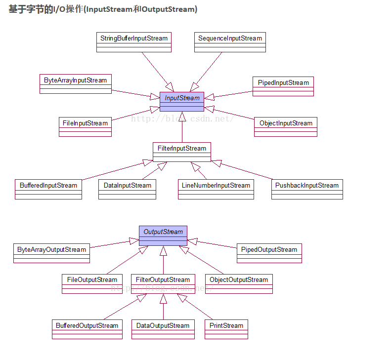
#### nio
> [nio基础](https://github.com/CyC2018/CS-Notes/blob/master/notes/Java%20IO.md#%E4%B8%83nio)

* 所谓编码就是把字符转换为字节，解码就是把字节重新组合成字符
* nio缓冲区变量
	1. limit：所有对Buffer读写操作都会以limit变量的值作为上限。
	2. position：代表对缓冲区进行读写时，当前游标的位置。
	3. capacity：代表缓冲区的最大容量（一般新建一个缓冲区的时候，limit的值和capacity的值默认是相等的）。

	
* clear()方法**用于写模式**，其作用为清空Buffer中的内容，所谓清空是指写上限与Buffer的真实容量相同，即limit==capacity,同时将当前写位置置为最前端下标为0处。

* rewind()在读写模式下都可用，它单纯的将当前位置置0，同时取消mark标记，仅此而已；也就是说写模式下limit仍保持与Buffer容量相同，只是重头写而已；读模式下limit仍然与rewind()调用之前相同，也就是为flip()调用之前写模式下的position的最后位置，flip()调用后此位置变为了读模式的limit位置，即越界位置

* flip()函数的作用是将**写模式转变为读模式**，即将写模式下的Buffer中内容的最后位置变为读模式下的limit位置，作为读越界位置，同时将当前读位置置为0，表示转换后重头开始读，同时再消除写模式下的mark标记

* NIO 实现了 IO 多路复用中的 Reactor 模型，一个线程 Thread 使用一个**选择器 Selector** 通过轮询的方式去监听多个通道 Channel 上的事件，从而让一个线程就可以处理多个事件。**只有套接字 Channel 才能配置为非阻塞，而 FileChannel 不能，为 FileChannel 配置非阻塞也没有意义。**
* 将通道注册到选择器上
```
ServerSocketChannel ssChannel = ServerSocketChannel.open();
ssChannel.configureBlocking(false);
ssChannel.register(selector, SelectionKey.OP_ACCEPT);
```
> 

* NIO 与普通 I/O 的区别主要有以下两点：
	1. NIO 是非阻塞的；
	2. NIO 面向块，I/O 面向流。


### Spring
#### spring bean 
> https://www.cnblogs.com/xrq730/p/4912876.html

* spring bean的scope表示的bean的作用于，有prototype、request、session、singleton四种。其中，singleton为默认scope，表示单例。prototype表示每次创建都会产生一个bean实例。request和session只在web项目中才会用，其作用域就和web中的request和session一样
* lazy-init表示的是bean的生命周期，默认为false。**当scope=singleton时，bean会在装在配置文件时实例化**，如果希望bean在产生时才实例化，可以把lazy-init设置为true。当scope=prototype时，在产生bean时才会实例化它。补充一点，如果希望该配置文件中所有的bean都延迟初始化，则应该在beans根节点中使用lazy-init="true"
* [bean加载流程概览](https://www.cnblogs.com/xrq730/p/6285358.html),classPathXmlApplicationContext的构造函数：
	1. super(parent),设置父级ApplicationContext
	2. setConfigLocations(configLocations),将指定的Spring配置文件的路径存储在本地，解析Spring配置文济南路径中的${PlaceHolder}占位符，替换为系统变量汇中PlaceHolder对应的Value值。
	3. refresh():个Spring Bean加载的核心了，它是ClassPathXmlApplicationContext的父类AbstractApplicationContext的一个方法，顾名思义，用于刷新整个Spring上下文信息，定义了整个Spring上下文加载的流程。
* 关于refresh方法：
	1. 方法是加锁的，这么做的原因是避免多线程同时刷新Spring上下文
	2. 没有在方法前加synchronized关键字，而使用了对象锁startUpShutdownMonitor，refresh()方法和close()方法都使用了startUpShutdownMonitor对象锁加锁，这就保证了在调用refresh()方法的时候无法调用close()方法，反之亦然，避免了冲突并且使用monitor减少了同步的范围。
* [applicationContext和beanfactory的区别](https://www.cnblogs.com/xiaoxi/p/5846416.html)
* spring bean的生命周期：
	1. > https://www.cnblogs.com/kenshinobiy/p/4652008.html
	2. > https://www.cnblogs.com/kenshinobiy/p/4652008.html
	
#### IOC原理
> https://www.cnblogs.com/ITtangtang/p/3978349.html

* IOC容器初始化的基本步骤
1. 初始化的入口在容器实现中的refresh()调用来完成
2. 对bean定义载入IOC容器使用的方法时`loadBeanDefinition`,大致过程为：通过`ResourceLoader`来完成资源文件位置的定位，`DefaultResourceLoader`是默认的实现,同时上下文本身就给出了`ResourceLoader`的实现,可以从类路径、文件系统、URL等方式来定位资源位置。如果XmlBeanFactory为IOC容器，那么需要为它指定bean定义的资源，也就是说bean定义文件时通过抽象成Resource来被IOC容器处理的，容器通过`BeanDefinitionReader`来完成定义信息的解析和Bean信息的注册，往往使用的是`XmlBeanDefinitionReader`来完成定义信息的解析和Bean信息的注册，从而得到bean的定义信息，这些信息在Spring中使用`BeanDefinition`（这个名字让我们想到`loadBeanDefinition,RegisterBeanDefinition`这些方法，他们都是为处理`BeanDefinitin`服务的。容器解析得到BeanDefinitionIOC以后，需要把它在IOC容器中注册，这由IOC实现`BeanDefinitionRegistry`接口来实现。注册过程就是在IOC容器内部维护一个HashMap来保存得到的`BeanDefinition`的过程。这个HashMap是IOC容器持有bean信息的场所，以后对bean的操作都是围绕着这个HashMap来实现的。
3. 然后我们就可以通过 BeanFactory 和 ApplicationContext 来享受到 Spring IOC 的服务了,在使用 IOC 容器的时候，我们注意到除了少量粘合代码，绝大多数以正确 IoC 风格编写的应用程序代码完全不用关心如何到达工厂，因为容器将把这些对象与容器管理的其他对象钩在一起。基本的策略是把工厂放到已知的地方，最好是放在对预期使用的上下文有意义的地方，以及代码将实际需要访问工厂的地方。 Spring 本身提供了对声明式载入 web 应用程序用法的应用程序上下文,并将其存储在ServletContext 中的框架实现。
> 使用 Spring IOC 容器的时候我们还需要区别两个概念:
Beanfactory 和 Factory bean，其中 BeanFactory 指的是 IOC 容器的编程抽象，比如 ApplicationContext， XmlBeanFactory 等，这些都是 IOC 容器的具体表现，需要使用什么样的容器由客户决定,但 Spring 为我们提供了丰富的选择。 FactoryBean 只是一个可以在 IOC而容器中被管理的一个 bean,是对各种处理过程和资源使用的抽象,Factory bean 在需要时产生另一个对象，而不返回 FactoryBean本身,我们可以把它看成是一个抽象工厂，对它的调用返回的是工厂生产的产品。所有的 Factory bean 都实现特殊的org.springframework.beans.factory.FactoryBean 接口，当使用容器中 factory bean 的时候，该容器不会返回 factory bean 本身,而是返回其生成的对象。Spring 包括了大部分的通用资源和服务访问抽象的 Factory bean 的实现，其中包括:对 JNDI 查询的处理，对代理对象的处理，对事务性代理的处理，对 RMI 代理的处理等，这些我们都可以看成是具体的工厂,看成是SPRING 为我们建立好的工厂。也就是说 Spring 通过使用抽象工厂模式为我们准备了一系列工厂来生产一些特定的对象,免除我们手工重复的工作，我们要使用时只需要在 IOC 容器里配置好就能很方便的使用了

#### AOP
* AOP是一种“横切”技术，将影响读个类的公共行为封装到一个可重用模块（切面），用于减少重复代码，降低耦合，并有利于未来的可操作性和可维护性。
* **Spring中的AOP代理由Spring的IOC容器负责生成、管理，其依赖关系也由IOC容器负责管理**。因此，AOP代理可以直接使用容器中的其他bean实例
* Aop代理主要分为静态代理和动态代理。静态代理的代表为AspectJ，而动态代理则以Spring AOP为代表。
* AspectJ是静态代理的增强，所谓的静态代理就是AOP框架会在编译阶段生成AOP代理类，因此也称为编译时增强。
* Spring AOP中的动态代理主要有两种方式，**JDK动态代理**和**CGLIB动态代理**。JDK动态代理通过反射来接收被代理的类，并且要求被代理的类必须实现一个接口。JDK动态代理的核心是InvocationHandler接口和Proxy类。如果目标类没有实现接口，那么Spring AOP会选择使用CGLIB来动态代理目标类。
> AspectJ在编译时就增强了目标对象，Spring AOP的动态代理则是在每次运行时动态的增强，生成AOP代理对象，区别在于生成AOP代理对象的时机不同  ，**相对来说AspectJ的静态代理方式具有更好的性能，但是AspectJ需要特定的编译器进行处理，而Spring AOP则无需特定的编译器处理**。
* [cglib动态代理机制](https://www.jianshu.com/p/9a61af393e41?from=timeline&isappinstalled=0)
1. 代理类是由Enhancer类创建的。Enhancer是CGLIB的字节码增强器
2. 创建代理对象那个的几个步骤
	1. 生成代理类的二进制字节码文件
	2. 加载字节码，生成Class对象（例如使用Class.forName()方法）
	3. 通过反射获得构造实例，并创建代理类对象

3. 代理类实际上继承了被代理类，因此如果代理类是final，则不能被代理
4. 在JDK动态代理中方法的调用是通过反射来完成的。但是在CGLIB中，方法的调用并不是通过反射来完成的，而是直接对方法进行调用

#### spring事务
##### [spring事务的实现方式](https://www.cnblogs.com/WJ-163/p/6035462.html)
1. 配置事务管理器以及事务代理工厂bean（TransactionProxyFactoryBean)
2. 通过注解
3. 通过Aspectj AOP配置事务。

##### spring事务的底层原理
> https://blog.csdn.net/zhousenshan/article/details/78509250
> https://www.
> liangzl.com/get-article-detail-16667.html 
* Spring的事务管理机制实现的原理，就是通过这样一个动态代理对所有需要事务管理的Bean进行加载，并根据配置在invoke方法中对当前调用的 方法名进行判定，并在method.invoke方法前后为其加上合适的事务管理代码，这样就实现了Spring式的事务管理

##### spring mvc
###### model
* Model本身是一个接口，其实现类为ExtendedModelMap，除了使用Model之外还可以使用ModelAndView、ModelMap这些(最终都会被转化为ExtendedModelMap)。
* [springMVC工作流程](https://blog.csdn.net/u014191220/article/details/81387596)
###### [springMVC启动流程](https://www.cnblogs.com/RunForLove/p/5688731.html)
1. ContextLoaderListener类起着至关重要的作用。它读取web.xml中配置的context-param中的配置文件，提前在web容器初始化前准备业务对应的Application context;将创建好的Application context放置于ServletContext中，为springMVC部分的初始化做好准备。
2. DispatchServlet名如其义，它的本质上是一个Servlet。下层的子类不断的对HttpServlet父类进行方法扩展。
3. HttpServletBean继承了HttpServlet,重写了init()方法，在这部分，我们可以看到其实现思路：公共的部分统一来实现，变化的部分统一来抽象，交给其子类来实现，故用了abstract class来修饰类名。此外，HttpServletBean提供了一个HttpServlet的抽象实现，使的Servlet不再关心init-param部分的赋值，让servlet更关注于自身Bean初始化的实现。
4. FrameworkServlet继承了HttpServletBean提供了整合web javabean和spring application context的整合方案。
5. DispatchServlet是HTTP请求的中央调度处理器，它将web请求转发给controller层处理，它提供了敏捷的映射和异常处理机制。DispatchServlet转发请求的核心代码在doService()方法中实现
* DispatchServlet设计特点
	1. 模板方法、策略模式的应用。
	2. 单一职责，边界清晰。HttpServletBean提供了一个HttpServlet的模板，让HttpServlet初始化更方便，FrameWorkServlet整合spring web bean到Spring容器中，管理WebApplicatioNContext,约定了一些Spring配置文件加载策略，统一提供了一个SpringMVC环境的容器条件。DispatchServlet自动整合了SpringMVC容器环境，专注于自定义策略的初始化
	3. 统一公共的实现，把变化的东西抽象出去，交给子类去实现
	4. 约定于配置结合，策略配置了按配置来走，没有配置就按约定来实现。

##### [spring单例模式原理](https://ltyeamin.github.io/2018/03/27/%E5%8D%95%E4%BE%8B%E6%A8%A1%E5%BC%8F-Spring%E5%8D%95%E4%BE%8B%E5%AE%9E%E7%8E%B0%E5%8E%9F%E7%90%86%E5%88%86%E6%9E%90/)
* Spring对Bean实例的创建是采用**单例注册表**的方式进行实现的，而**这个注册表的缓存是 ConcurrentHashMap对象**。

##### spring getBean原理
> https://www.jianshu.com/p/bab6f7ffa417
> https://www.jianshu.com/p/5d2db2981619

##### [spring中涉及的设计模式](https://www.cnblogs.com/jifeng/p/7398852.html)
1. 简单工厂：spring的beanFactory就是一个简单工厂，传入beanName获取bean实例
2. 工厂方法:???
3. 单例模式：spring使用单例注册表实现单例
4. 适配器模式：AdvisorAdapter 
5. 装饰器模式：spring中用到的包装器模式在类名上有两种表现：一种是类名中含有Wrapper，另一种是类名中含有Decorator。基本上都是动态地给一个对象添加一些额外的职责。 
6. 代理模式 Aop的原理就是动态代理
7. 观察者模式：spring启动时contextLoaderListener的父类servletContextListener使用了观察者模式，容器中的Filter和servlet初始化前和销毁后会给ServletContextListener发送响应的通知
8. 策略模式：SimpleInstantiationStrategy
9. 模板模式：jdbcTemplate


#### spring boot
#### spring cloud
* 项目

### 知识点


### 笔记

### 算法


### 设计模式
#### 创建型
##### 简单工厂模式
* 简单工厂模式提供一个对象实例的功能，而无须关心其具体的实现。被创建的实例可以是接口，抽象类，也可以是具体的类。
* 简单工厂模式的核心是：选择实现

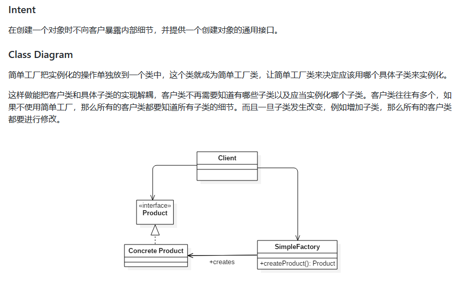

##### 工厂方法模式
* 工厂方法模式定义一个用于创建对象的接口，让子类决定实例化哪一个类，Factory Method使一个类的实例化延迟到其子类。
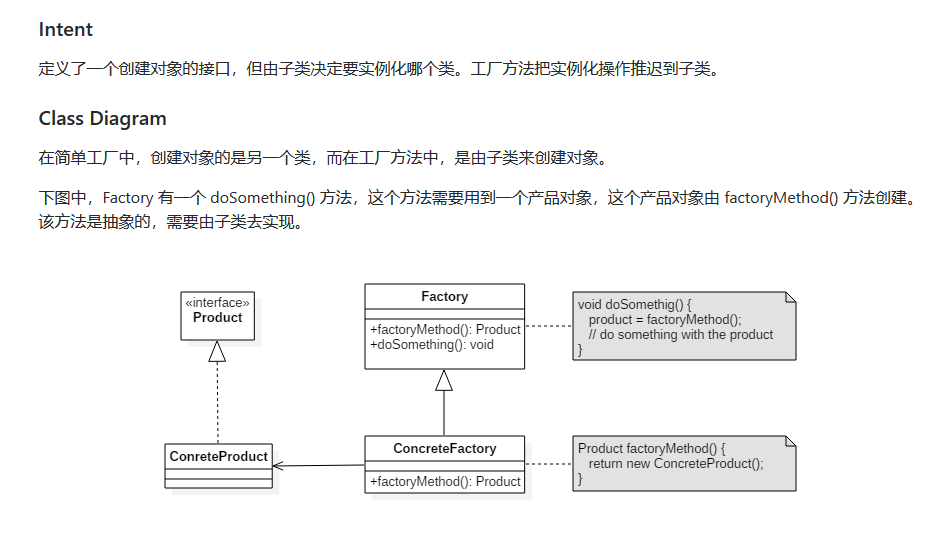
* 工厂方法模式的主要功能是让父类在不知道具体实现的情况下，完成自身的功能调用而具体的实现延迟到子类来实现。
* 工厂方法模式的本质：延迟到子类来选择实现。
* JDK
	* java.util.Calendar
	* java.util.ResourceBundle
	* java.text.NumberFormat

##### 抽象工厂模式
* 抽象工厂模式提供一个创建一系列相关或者相互依赖对象的接口，而无需指定它们具体的类。
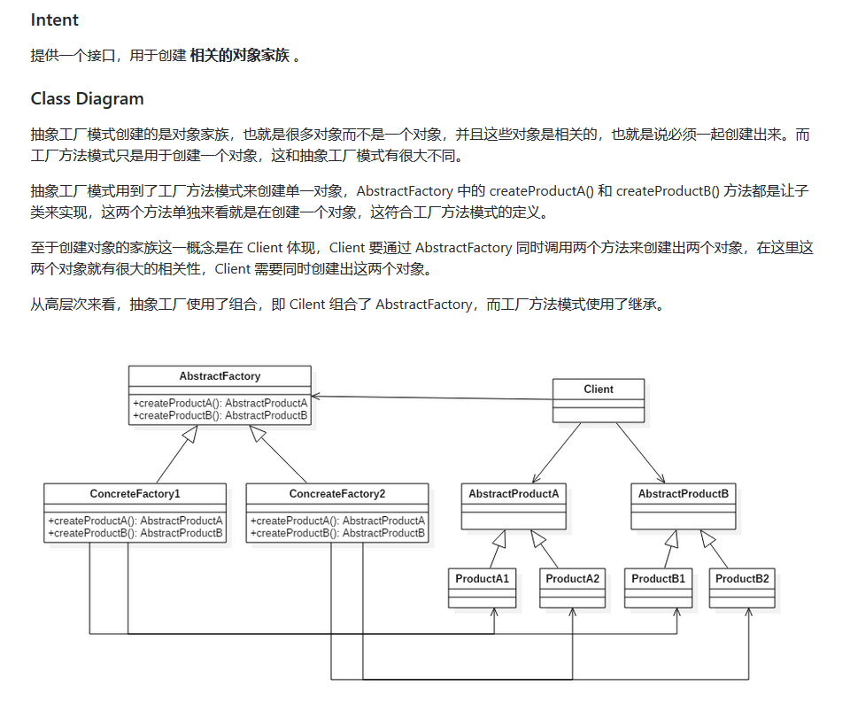
* 抽象工厂模式的核心：选择产品簇的实现
* JDK
	* javax.xml.parsers.DocumentBuilderFactory
	* javax.xml.transform.TransformerFactory
	* javax.xml.xpath.XPathFactory

##### 单例模式
* 单例模式保证一个类仅有一个实例，并提供一个访问它的全局访问点。
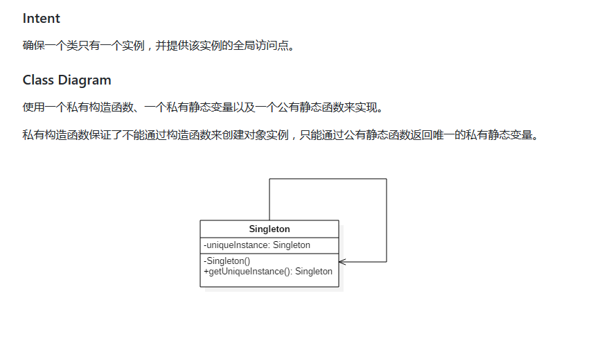
* 创建单例模式的方法
	1. 懒汉式
	2. 饿汉式
	3. 懒汉式线程安全变种
	4. 饿汉式线程安全变种
	5. 静态内部类
	6. 双重校验锁
	7. 枚举类型
* 单例模式的本质：控制实例数目
* JDK
	* java.lang.Runtime#getRuntime()
	* java.lang.System#getSecurityManager()

##### 生成器模式
* 将一个复杂对象的构建与它的表示分离，使得同样的构建过程可以创建不同的表示。
* 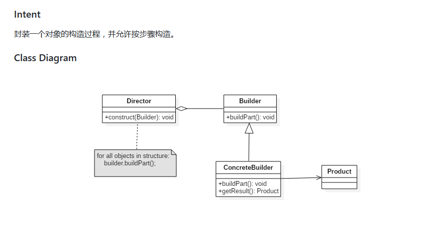
* 生成器模式的本质：分离整体构建算法和部件构造。
* JDK
	* java.lang.StringBuilder
	* java.lang.StringBuffer
	* java.nio.ByteBuffer

##### 原型模式
* 用原型实例指定创建对象的种类，并通过拷贝这些原型创建新的对象。
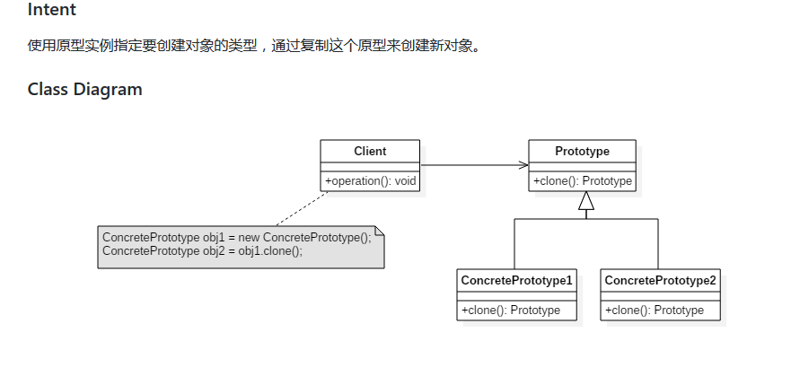
* 原型模式的本质：克隆生成对象
* JDK
	* java.lang.Object#clone()


#### 行为型
##### 状态模式
* 状态设计模式允许一个对象在其内部状态改变时改变它的行为。对象看起来似乎修改了它的类。
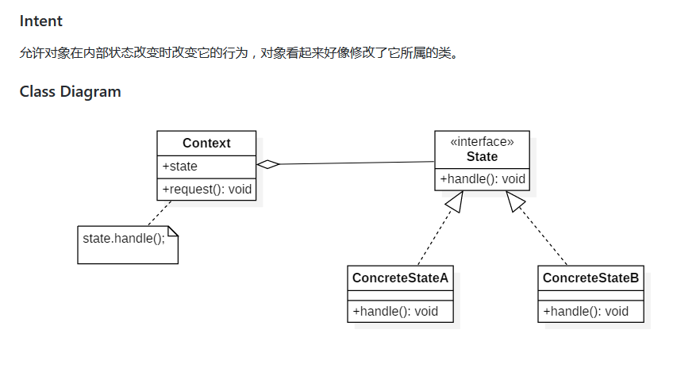
* 状态模式的本质：根据状态来分离和选择行为。

##### 策略模式
* 定义一系列算法，把他们一个个封装起来，并且使它们可相互替换。策略模式使得算法可独立于使用它的客户而变化。
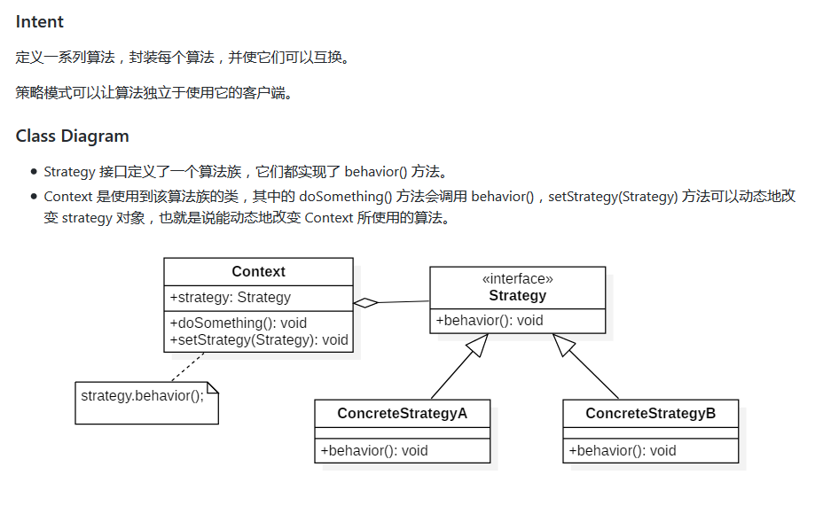
* 策略模式的本质：分离算法，选择实现
* JDK
	* java.util.Comparator#compare()
	* javax.servlet.http.HttpServlet
	* javax.servlet.Filter#doFilter()

##### 模板设计模式
* 模板方法定义一个操作中的算法的骨架，而将一些步骤延迟到子类中。模板方法使的子类可以不改变一个算法的结构即可重新定义该算法的某些特定步骤。
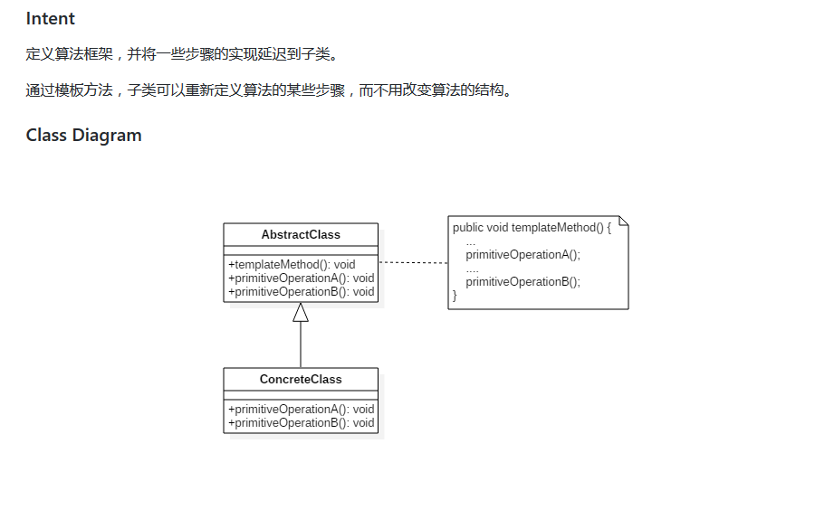
* 模板方法模式的本质：固定算法骨架
* JDK
	* java.util.Collections#sort() （也可以看做策略模式？）
	* java.io.InputStream#skip() （？？？？？）
	* java.io.InputStream#read() （？？？？？）
	* java.util.AbstractList#indexOf() 
	* spring IOC ClassPathXmlApplicatioContext构造函数中的reflush()
	* SpringMVC dispatchservlet

##### 责任链模式
* 使多个对象都有机会处理请求，从而避免请求的发送者和请求者之间的耦合关系。将这些对象连成一条链，并沿着这条链传递该请求，知道有一个对象处理它为止。
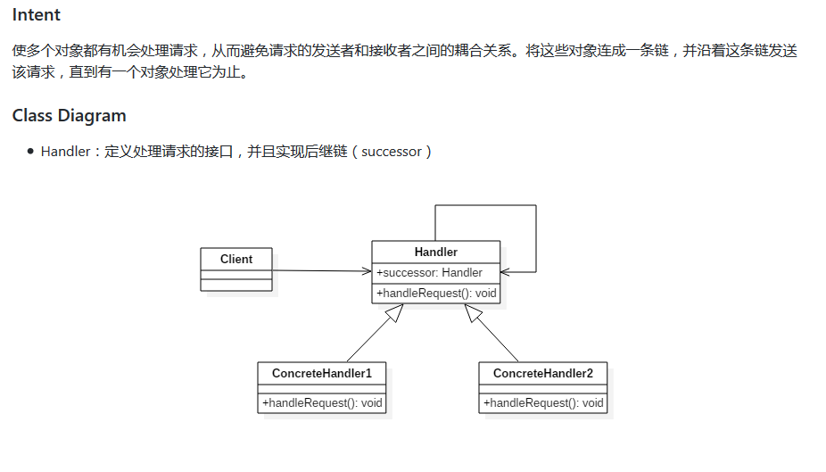
* 责任链模式的本质：分离职责，动态组合
* JDK
	* java.servlet.Filter#doFilter()
	* java.util.logging.Logger#log()

##### 中介者模式
* 用一个中介对象来封装一系列的对象交互。中介者使得各对象不需要显式地相互引用，从而使其耦合松散，而且可以独立第改变他们之间的交互。
* 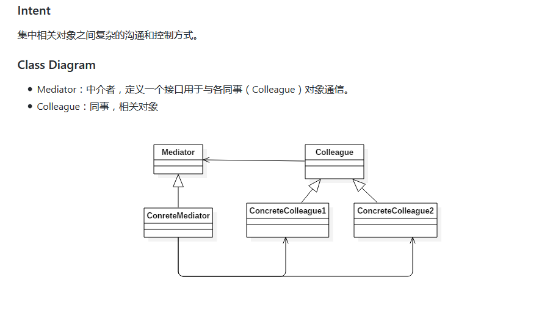
* 中介者模式的本质：封装交互
* JDK
	* All scheduleXXX() methods of java.util.Timer
	* java.util.concurrent.Executor#execute()
	* java.lang.reflect.Method#invoke()
	
##### 观察者模式
* 定义对象间的一种一对多的依赖关系。当一个对象的状态发生改变时，所有依赖于它的对象都得到通知并被自动更新。
* 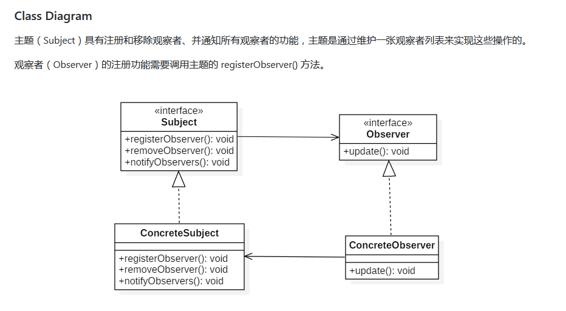
* 观察者模式的本质：触发联动
* JDK
	* java.util.Observer
	* java.util.EventListener
	* [Rxjava](https://www.jianshu.com/p/cd3557b1a474),rxjava是一个异步链式库，基于观察者模式
	* spring mvc servletContextListener servlet和Filter初始化前和销毁后，都会给实现了servletContextListener接口的监听器发出相应的通知。

##### 命令模式
* 命令模式将一个请求封装为一个对象，从而使你可用不同的请求对客户进行参数化；对请求或记录请求日志，以及支持可撤销的操作。
* 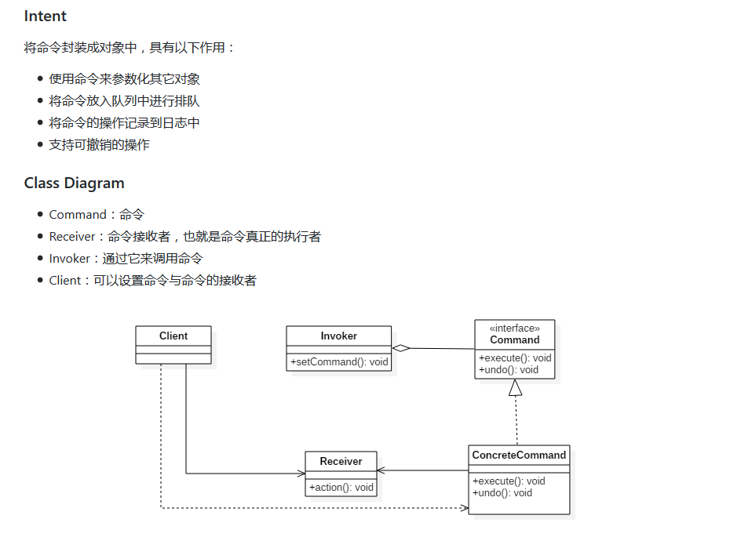
* 命令模式的本质：封装请求
* JDK
	* java.lang.Runnable
	* Netflix Hystrix


##### 迭代器模式
* 提供一种方法顺序访问一个聚合对象中的各个元素，而又不需暴露该对象的内部表示
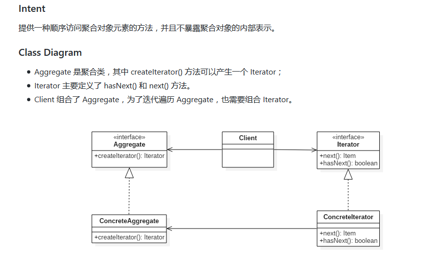
* 迭代器模式的本质：控制访问聚合对象中的元素
* JDK
	* java.util.Iterator
	* java.util.Enumeration

##### 备忘录模式
* 在不破坏封装性的前提下，捕获一个对象的内部状态，并在该对象之外保存这个状态。这样以后就就可将对象恢复到原先保存的状态。
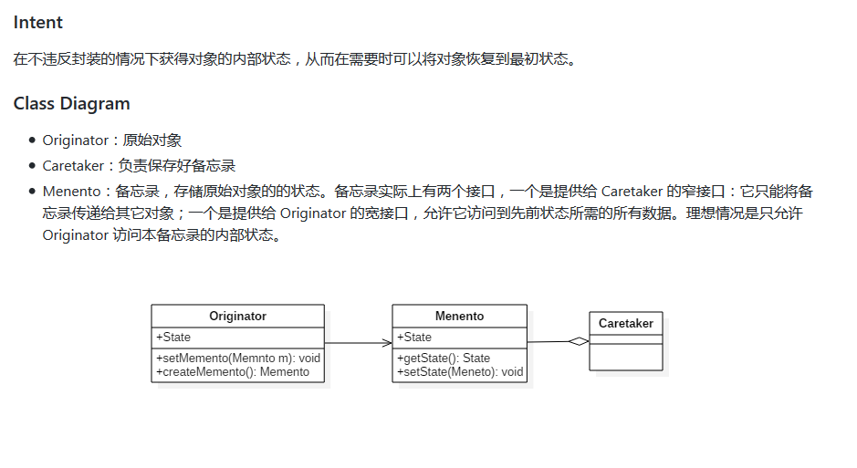
* 备忘录模式的本质：保存和恢复内部状态。
* JDK:
	* java.io.Serializable 

##### 访问者模式
* 访问者模式表示一个作用与某对象结构中的各元素的操作。使你可以在不改变元素的类的前提下定义作用于这些元素的新操作。
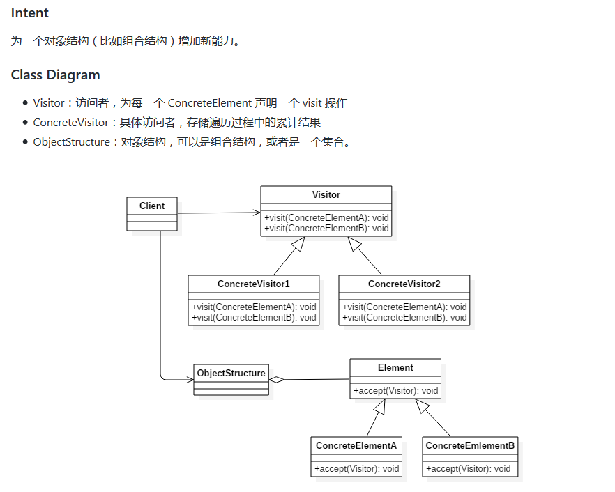
* 访问者模式的本质：回调实现

#### 结构型
##### 外观设计模式
* 外观模式为子系统中的一组接口提供一个一致的界面，Facade模式定义了一个高层接口，这个接口使的这一子系统更加容易使用。
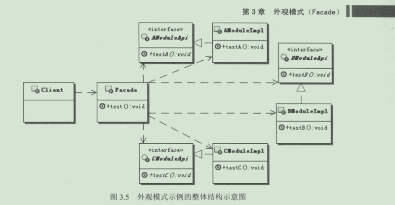
* 外观模式的本质：封装交互，简化调用
* 设计原则：最少知识原则。

##### 适配器模式
* 将一个类的接口转换成客户希望的另外一个接口。适配器模式使得原本由于接口不兼容而不能一起工作的那些类可以一起工作。
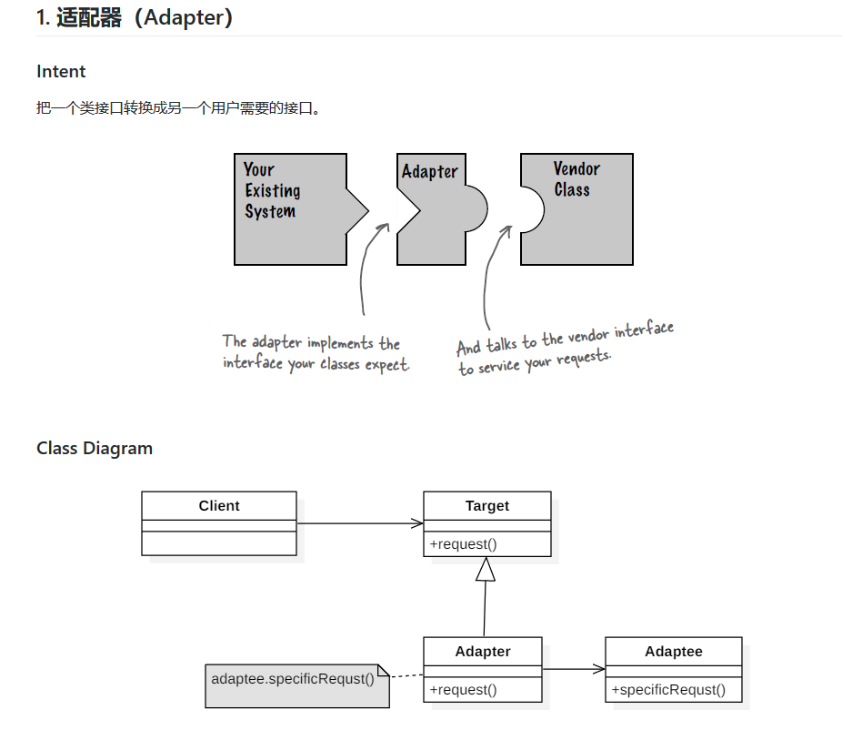
* 适配器模式本质：转换匹配，复用功能
* JDK
	* java.util.Arrays#asList() 
	* java.util.Collections#list()

##### 享元设计模式
* 享元模式运用共享技术有效地支持大量细粒度的对象

* 享元对象的本质：分离与共享。分离的是对象状态中变的部分，共享的是对象中不变的部分。
* JDK
	* java.lang.Integer#valueOf(int)
	* java.lang.Byte#valueOf(byte)
	* java.lang.Character#valueOf(char)

##### 装饰模式
* 动态地给一个对象添加一些额外的职责。就增加功能来说，装饰模式比生成子类更为灵活。
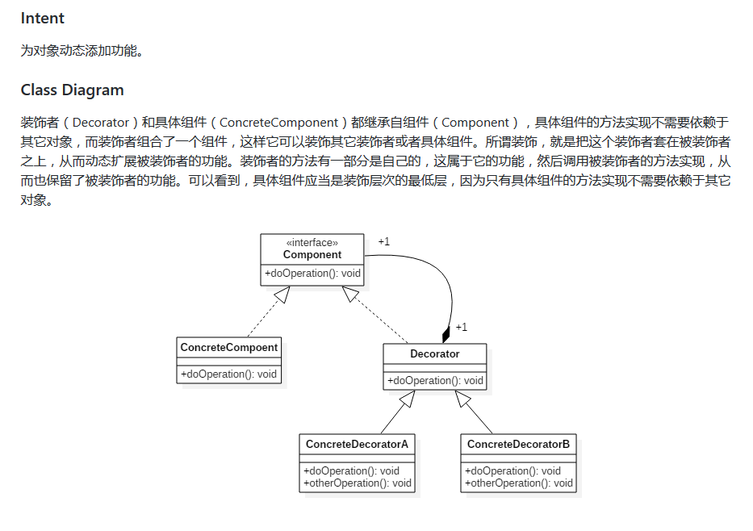
* 装饰模式的核心：动态组合
* 设计原则：类应该对扩展开放，对修改关闭：也就是添加新功能时不需要修改代码

##### 代理模式
* 代理模式为其他对象提供一种代理以控制对这个对象的访问。
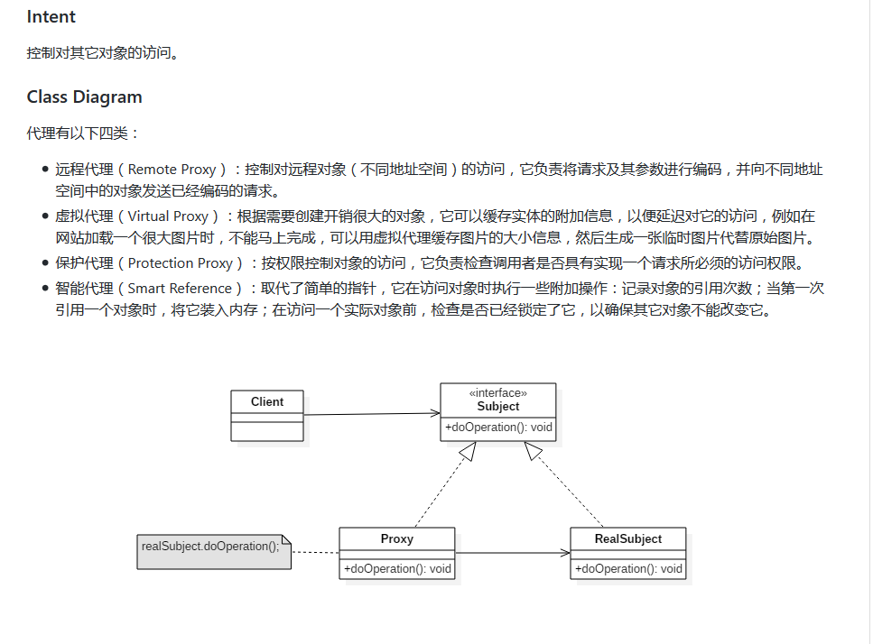
* 代理模式的本质：控制对象访问。

##### 组合模式
* 将对象组合成树型结构以表示“部分-整体”的层次结构。组合模式使的用户对单个对象和组合对象的使用具有一致性。
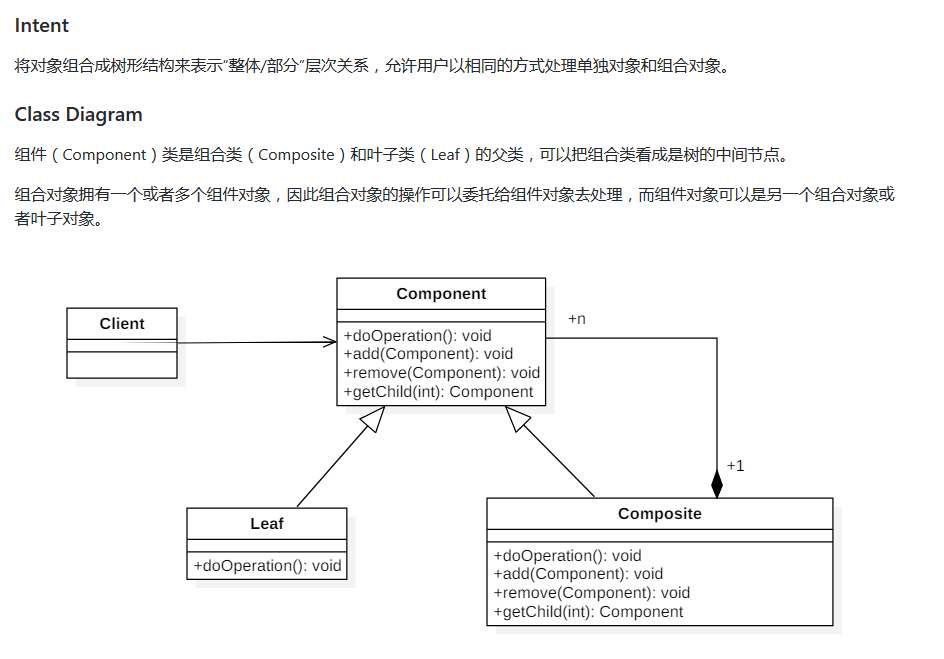
* 组合对象的本质：统一叶子对象和组合对象

##### 桥接模式
* 将抽象部分与它的实现部分分离，使它们都可以独立地变化。
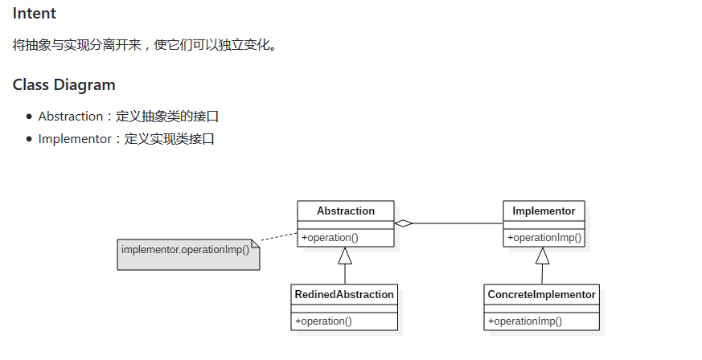
* 桥接模式的本质：分离抽象和实现

### 项目


### shell

### vue
* [MVVM](https://www.liaoxuefeng.com/wiki/001434446689867b27157e896e74d51a89c25cc8b43bdb3000/001475449022563a6591e6373324d1abd93e0e3fa04397f000)

### js
* ES6异步

### github


### 分布式
* 分布式锁的三种实现方式：
	1. 数据库乐观锁（   使用自增长的整数表示数据版本号。更新时检查版本号是否一致，比如数据库中数据版本为6，更新提交时version=6+1,使用该version值(=7)与数据库version+1(=7)作比较，如果相等，则可以更新，如果不等则有可能其他程序已更新该记录，所以返回错）
	2. 基于Redis的分布式锁
	3. 基于ZooKeeper的分布式锁
#### redis分布式锁的实现
* 分布式锁所需要满足的四个条件
	1. **互斥性**。在任意时刻，只有一个客户端能持有锁
	2. **不会发生死锁**。即使有一个客户端在持有锁的期间崩溃而没有主动解锁，也能保证后续其他客户端能加锁。
	3. **具有容错性**。只要大部分的Redis节点正常运行，客户端就可以加锁和解锁。
	4. **解铃还须系铃人**。加锁和解锁必须是同一客户端，客户端自己不能把别人加的锁给解了。
> https://blog.csdn.net/josn_hao/article/details/78412694
* 如果Redis是多机部署的，那么可以尝试使用**Redission**实现分布式锁，这是Redis官方提供的Java组件。.

#### 分布式session实现方案
##### session复制
*  简介：将一台机器上的Session数据广播复制到集群中其余机器上
*  使用场景：机器较少，网络流量较小
*  优点：实现简单、配置较少、当网络中有机器Down掉时不影响用户访问
*  缺点：广播式复制到其余机器有一定廷时，带来一定网络开销

##### 粘性Session
*  简介：当用户访问集群中某台机器后，强制指定后续所有请求均落到此机器上
*  使用场景：机器数适中、对稳定性要求不是非常苛刻
*  优点：实现简单、配置方便、没有额外网络开销
*  缺点：网络中有机器Down掉时、用户Session会丢失、容易造成单点故障

##### 缓存集中式管理
* 简介：将Session存入分布式缓存集群中的某台机器上，当用户访问不同节点时先从缓存中拿Session信息
* 使用场景：集群中机器数多、网络环境复杂
* 优点：可靠性好
* 缺点：实现复杂、稳定性依赖于缓存的稳定性、Session信息放入缓存时要有合理的策略写入

##### spring redis分布式session共享
> https://www.cnblogs.com/jiafuwei/p/6425604.html

#### 分布式事务解决方案
> https://blog.csdn.net/mine_song/article/details/64118963
> https://www.cnblogs.com/savorboard/p/distributed-system-transaction-consistency.html

1. 基于XA协议的两阶段提交（2pc)
* 尽量保证了数据的强一致，适合对数据强一致要求很高的关键领域。（其实也不能100%保证强一致）
* XA也有致命的缺点，那就是性能不理想，特别是在交易下单链路，往往并发量很高，XA无法满足高并发场景。XA目前在商业数据库支持的比较理想，在mysql数据库中支持的不太理想，mysql的XA实现，没有记录prepare阶段日志，主备切换回导致主库与备库数据不一致。许多nosql也没有支持XA，这让XA的应用场景变得非常狭隘。

2. 消息事务+最终一致性
* 所谓的消息事务就是基于消息中间件的两阶段提交，本质上是对消息中间件的一种特殊利用，它是将本地事务和发消息放在了一个分布式事务里，保证要么本地操作成功成功并且对外发消息成功，要么两者都失败
* 基于消息中间件的两阶段提交往往用在高并发场景下，将一个分布式事务拆成一个消息事务（A系统的本地操作+发消息）+B系统的本地操作，其中B系统的操作由消息驱动，只要消息事务成功，那么A操作一定成功，消息也一定发出来了，这时候B会收到消息去执行本地操作，如果本地操作失败，消息会重投，直到B操作成功，这样就变相地实现了A与B的分布式事务。

3. TCC（补偿模式）
* TCC 其实就是采用的补偿机制，其核心思想是：针对每个操作，都要注册一个与其对应的确认和补偿（撤销）操作。其分为三个阶段
	1. Try阶段主要是对业务系统做检测和资源预留
	2. Confirm阶段只要是对业务系统做确认提交，Try阶段执行成功并开始执行Confirm阶段时，默认Confirm阶段时不会出错的。即：只要Try成功，Confirm一定会成功
	3. Cancel阶段主要是在业务执行错误，需要回滚的状态下执行的业务取消，预留资源释放。
* 跟2PC比起来，实现以及流程相对简单了一些，但数据的一致性比2PC也要差一些，CC属于应用层的一种补偿方式，所以需要程序员在实现的时候多写很多补偿的代码，在一些场景中，一些业务流程可能用TCC不太好定义及处理。

#### BASE理论(https://www.cnblogs.com/szlbm/p/5588543.html)
* BASE是Basically Available（基本可用）、Soft state（软状态）和Eventually consistent（最终一致性）三个短语的缩写。BASE理论是对CAP中一致性和可用性权衡的结果，其来源于对大规模互联网系统分布式实践的总结， 是基于CAP定理逐步演化而来的。BASE理论的核心思想是：即使无法做到强一致性，但每个应用都可以根据自身业务特点，采用适当的方式来使系统达到最终一致性。
	1. 基本可用：基本可用，基本可用是指分布式系统在出现不可预知故障的时候，允许损失部分可用性
	2. 软状态：软状态指允许系统中的数据存在中间状态，并认为该中间状态的存在不会影响系统的整体可用性，即允许系统在不同节点的数据副本之间进行数据同步的过程存在延时
	3. 最终一致性：最终一致性强调的是所有的数据副本，在经过一段时间的同步之后，最终都能够达到一个一致的状态。因此，最终一致性的本质是需要系统保证最终数据能够达到一致，而不需要实时保证系统数据的强一致性。
* 总的来说，BASE理论面向的是大型高可用可扩展的分布式系统，和传统的事物ACID特性是相反的，它完全不同于ACID的强一致性模型，而是通过牺牲强一致性来获得可用性，并允许数据在一段时间内是不一致的，但最终达到一致状态。但同时，在实际的分布式场景中，不同业务单元和组件对数据一致性的要求是不同的，因此在具体的分布式系统架构设计过程中，ACID特性和BASE理论往往又会结合在一起。

### web
#### [servlet单例多线程](https://www.cnblogs.com/yjhrem/articles/3160864.html)
##### Servlet容器如何同时处理多个请求
* servelt容器是采用单实例多线程的方式处理多个请求的
	1.  当web服务器启动的时候（或客户端发送请求到服务器时），Servlet就被加载并实例化（只存在一个Servlet实例）；
	2.  容器初始化Servlet。主要就是读取配置文件（例如tomcat，可以通过servlet.xml的<Connector>设置线程池中线程数目，初始化线程池；通过web.xml，初始化每个参数值等等）；
	3.  当请求到达时，Servlet容器通过调度线程（Dispatchaer Thread）调度它管理下的线程池中等待执行的线程（Worker Thread）给请求者；
	4.  线程执行Servlet的service方法；
	5.  请求结束，放回线程池，等到被调用；

* Servlet单实例，减少了产生servlet的开销；
* 通过线程池来响应多个请求，提高了请求的响应时间；
* Servlet容器并不关心到达的Servlet请求访问的是否是同一个Servlet还是另一个Servlet，直接分配给它一个新的线程；如果是同一个Servlet的多个请求，那么Servlet的service方法将在多线程中并发的执行；
* 每一个请求由ServletRequest对象来接受请求，由ServletResponse对象来响应该请求；
##### servlet线程安全问题解决方案
1. 实现SingleThreadModel接口：如果一个Servlet被这个接口指定,那么在这个Servlet中的service方法将不会有两个线程被同时执行，当然也就不存在线程安全的问题；
2. 同步对共享数据的操作
3. 避免使用实例变量（成员变量）

### 数据库
#### [索引]（https://www.cnblogs.com/bypp/p/7755307.html）
##### 索引分类
1. 普通索引index：加速查找
2. 唯一索引
	* 主键索引： primary key:加速查找+约束（不为空且唯一）
	* 唯一索引：unique：加速查找+约束（唯一）
3. 联合索引
	* primary key(id,name):联合主键索引
	* unique(id,name):联系唯一索引
	* index(id,name)：联合普通索引
4. 全文索引fulltext:搜索很长一篇文章的时候效果最好
5. 空间索引spatial：几乎不用

##### 聚簇索引和非聚簇索引
> https://blog.csdn.net/lisuyibmd/article/details/53004848

* 聚簇索引的数据的物理存放顺序和索引顺序是一致的，即只要索引是相邻的，那么对应的数据一定也是相邻地存放在磁盘上的。聚簇索引要比非聚簇索引的查询效率高很多
* 非聚簇索引类似于图书的附录，哪个专业术语出现在哪个章节，这些专业术语是有顺序的，但是出现的位置是没有顺序的。每个表只能有一个聚簇索引，因为一个表中的记录只能以一种物理顺序存放。但是一个表可以有不止一个非聚簇索引。

##### 正确使用索引
* 覆盖索引
* 联合索引
* 索引合并：把多个单索引合并使用，组合索引能做到的事情，我们都可以用索引合并去解决。索引合并要比组合索引更能命中索引，但是有些情况下使用组合索引的效率要高于索引合并，如果是单条件查，那么还是用索引合并比较合理

##### 添加索引时必须遵循的原则：
1. 最左前缀匹配原则：索引必须按照从左到右的顺序匹配，mysql会一直向右匹配知道遇到范围查询(>,<,between,like)就停止匹配，比如a = 1 and b = 2 and c > 3 and d = 4 如果建立(a,b,c,d)顺序的索引，d是用不到索引的，如果建立(a,b,d,c)的索引则都可以用到，a,b,d的顺序可以任意调整。
2. =和in可以乱序，比如a = 1 and b = 2 and c = 3 建立(a,b,c)索引可以任意顺序，mysql的查询优化器会帮你优化成索引可以识别的形式
3. 尽量选择区分度高的列作为索引,区分度的公式是count(distinct col)/count(*)，表示字段不重复的比例，比例越大我们扫描的记录数越少，唯一键的区分度是1，而一些状态、性别字段可能在大数据面前区分度就是0
4. 索引列不能参与计算，保持列“干净”，比如from_unixtime(create_time) = ’2014-05-29’。就不能使用到索引，原因很简单，b+树中存的都是数据表中的字段值，但进行检索时，需要把所有元素都应用函数才能比较，显然成本太大。所以语句应该写成create_time = unix_timestamp(’2014-05-29’);

#### sql优化
1. **尽量少join**：MySQL 的优势在于简单，但这在某些方面其实也是其劣势。MySQL 优化器效率高，但是由于其统计信息的量有限，优化器工作过程出现偏差的可能性也就更多。对于复杂的多表 Join，一方面由于其优化器受限，再者在 Join 这方面所下的功夫还不够，所以性能表现离 Oracle 等关系型数据库前辈还是有一定距离。但如果是简单的单表查询，这一差距就会极小甚至在有些场景下要优于这些数据库前辈。
2. **尽量少排序**：排序操作会消耗较多的 CPU 资源，所以减少排序可以在缓存命中率高等 IO 能力足够的场景下会较大影响 SQL 的响应时间。
3. **尽量避免 select * **
4. **尽量用 join 代替子查询**
5. **尽量少 or**：当 where 子句中存在多个条件以“或”并存的时候，MySQL 的优化器并没有很好的解决其执行计划优化问题，再加上 MySQL 特有的 SQL 与 Storage 分层架构方式，造成了其性能比较低下，很多时候使用 union all 或者是union(必要的时候)的方式来代替“or”会得到更好的效果。
6. **尽量用 union all 代替 union**：union 和 union all 的差异主要是前者需要将两个(或者多个)结果集合并后再进行唯一性过滤操作，这就会涉及到排序，增加大量的 CPU 运算，加大资源消耗及延迟。所以当我们可以确认不可能出现重复结果集或者不在乎重复结果集的时候，尽量使用 union all 而不是 union。
7. **尽量早过滤**：这一优化策略其实最常见于索引的优化设计中(将过滤性更好的字段放得更靠前)，在 SQL 编写中同样可以使用这一原则来优化一些 Join 的 SQL。比如我们在多个表进行分页数据查询的时候，我们最好是能够在一个表上先过滤好数据分好页，然后再用分好页的结果集与另外的表 Join，这样可以尽可能多的减少不必要的 IO 操作，大大节省 IO 操作所消耗的时间。
8. **避免类型转换**

#### mysql分库分表
> https://www.cnblogs.com/mfmdaoyou/p/7246711.html
> https://www.cnblogs.com/sunny3096/p/8595058.html


#### [唯一ID方案](http://www.cnblogs.com/haoxinyue/p/5208136.html)
> https://tech.meituan.com/dianping_order_db_sharding.html?tdsourcetag=s_pctim_aiomsg

1. 利用数据库自增ID
	* 优点：最简单
	* 缺点：单点风险、单机性能瓶颈。
2. 利用数据库集群并设置相应的步长（Flickr方案）
	* 优点：高可用、ID较简洁。
	* 缺点：需要单独的数据库集群。
3. Twitter Snowflake
	* 优点：高性能高可用、易拓展。
	* 缺点：需要独立的集群以及ZK。
4. 一大波GUID、Random算法
	* 优点：简单。
	* 缺点：生成ID较长，有重复几率。
5. 大众点评的方案:时间戳+用户标识码+随机数
	* 优点
		* 方便、成本低。
		* 基本无重复的可能。
		* 自带分库规则，这里的用户标识码即为用户ID的后四位，在查询的场景下，只需要订单号就可以匹配到相应的库表而无需用户ID，只取四位是希望订单号尽可能的短一些，并且评估下来四位已经足够。
		* 可排序，因为时间戳在最前面。
	* 缺点：长度稍长，性能要比int/bigint的稍差等


##### 垂直切分（分区）
* 将表按照**功能模块**拆分，把不同业务的数据放到不同的数据库服务器上

##### 水平切分（分片）
* 当一个表中的数据量过大时，把该表的数据按照某种规则，例如UserId散列，按性别、按省进行划分，然后存储到多个结构相同的表中或不同的库上。

##### 分库分表产生的问题
1. 事务问题
* 在执行分库分表后，由于数据存储到了不同的库上，数据库事务管理出现了困难。如果依赖数据库本身的分布式事务管理功能去执行事务，将付出高昂的性能代价；如果由应用程序去协助控制，形成程序逻辑上的事务，又会造成编程方面的负担。
2. 跨库跨表的join问题
* 在执行分库分表之后，难免会将原本逻辑关联性很强的数据划分到不同的表、不同的库上，这时，表的关联操作将受到限制，我们无法join位于不同分库的表，也无法jon分表粒度不同的表，结果原本一次查询能够完成的业务，可能需要多次查询才能完成。
3. 额外的数据管理负担和数据运算压力
* 额外的数据管理负担，最显而易见的就是数据的定位问题和数据的增删改查的重复执行问题，这些都可以通过应用程序解决，但必然引起额外的逻辑运算。例如，对于一个记录用户成绩的用户数据表userTable，业务要求查出成绩最好的100位，在进行分表之前，只需一个order by语句就可以搞定，但是在进行分表之后，将需要n个order by语句，分别查出每一个分表的前100名用户数据，然后再对这些数据进行合并计算，才能得出结果。
4. 跨节点合并排序分页问题

#### [数据库分区](https://www.cnblogs.com/mliudong/p/3625522.html)
* 通俗地讲表分区是将一大表，根据条件分割成若干个小表。改善大型表以及具有各种访问模式的表的可伸缩性，可管理性和提高数据库效率。
* 分区类型
	1. RANGE分区:基于属于一个给定连续区间的列值，把多行分配给分区。
	2. LIST分区：类似于按RANGE分区，区别在于LIST分区是基于列值匹配一个离散值集合中的某个值来进行选择。
	3. HASH分区：基于用户定义的表达式的返回值来进行选择的分区，该表达式使用将要插入到表中的这些行的列值进行计算。这个函数可以包含MySQL 中有效的、产生非负整数值的任何表达式。
	4. KEY分区：类似于按HASH分区，区别在于KEY分区只支持计算一列或多列，且MySQL服务器提供其自身的哈希函数。必须有一列或多列包含整数值。


#### 数据库死锁
*  在数据库中有两种基本的锁类型：**排它锁（Exclusive Locks，即X锁）**和**共享锁（Share Locks，即S锁）**。当数据对象被加上排它锁时，其他的事务不能对它读取和修改。加了共享锁的数据对象可以被其他事务读取，但不能修改。数据库利用这两种基本的锁类型来对数据库的事务进行并发控制。 
*  数据库死锁的两种情况
1. 事务之间对资源访问顺序的交替
* 出现原因：一个用户A 访问表A（锁住了表A），然后又访问表B；另一个用户B 访问表B（锁住了表B），然后企图访问表A；这时用户A由于用户B已经锁住表B，它必须等待用户B释放表B才能继续，同样用户B要等用户A释放表A才能继续，这就死锁就产生了。
* 解决方法：
这种死锁比较常见，是由于程序的BUG产生的，除了调整的程序的逻辑没有其它的办法。仔细分析程序的逻辑，对于数据库的多表操作时，尽量按照相同的顺序进行处理，尽量避免同时锁定两个资源，如操作A和B两张表时，总是按先A后B的顺序处理， 必须同时锁定两个资源时，要保证在任何时刻都应该按照相同的顺序来锁定资源。
2. 并发修改同一记录
* 出现原因：用户A查询一条纪录，然后修改该条纪录；这时用户B修改该条纪录，这时用户A的事务里锁的性质由查询的共享锁企图上升到独占锁，而用户B里的独占锁由于A有共享锁存在所以必须等A释放掉共享锁，而A由于B的独占锁而无法上升的独占锁也就不可能释放共享锁，于是出现了死锁。这种死锁由于比较隐蔽，但在稍大点的项目中经常发生。
* 解决方法：
	1.  使用乐观锁进行控制。避免了长事务中的数据库加锁开销（用户A和用户B操作过程中，都没有对数据库数据加锁），大大提升了大并发量下的系统整体性能表现。Hibernate 在其数据访问引擎中内置了乐观锁实现。需要注意的是，由于乐观锁机制是在我们的系统中实现，来自外部系统的用户更新操作不受我们系统的控制，因此可能会造成脏数据被更新到数据库中。 
	2.  使用悲观锁进行控制。如果采用悲观锁机制，也就意味着整个操作过程中（从操作员读出数据、开始修改直至提交修改结果的全过程，甚至还包括操作员中途去煮咖啡的时间），数据库记录始终处于加锁状态，可以想见，如果面对成百上千个并发，这样的情况将导致灾难性的后果。
	3.  sqlserver支持更新锁解决死锁问题
3. 索引不当导致全表扫描
* 出现原因：如果在事务中执行了一条不满足条件的语句，执行全表扫描，把行级锁上升为表级锁，多个这样的事务执行后，就很容易产生死锁和阻塞。类似的情况还有当表中的数据量非常庞大而索引建的过少或不合适的时候，使得经常发生全表扫描，最终应用系统会越来越慢，最终发生阻塞或死锁。
* 解决方法：SQL语句中不要使用太复杂的关联多表的查询；使用“执行计划”对SQL语句进行分析，对于有全表扫描的SQL语句，建立相应的索引进行优化。


##### spring hibernate 分库查询
> https://blog.csdn.net/a314368439/article/details/80734838
> https://www.jianshu.com/p/a3ea36783fe0
* 基本步骤
	1. 配置多个数据源
	2. 实现AbstractRoutingDataSource的determineCurrentLookUpKey方法
	3. 定义数据源注解
	4. 使用spirng拦截需要进行数据源切换的方法，根据方法数据源注解决定数据源

### 消息队列
#### 消息队列使用场景
* 消息队列中间件是分布式中的重要组件，主要解决应用耦合、异步消息、流量削锋，消息通讯等问题。
#### [保证消息有序的解决思路]（https://yq.aliyun.com/articles/73672）
* 如果有多个consumer同时消费同一个queue，那就不能保证消息的顺序性。如果一定要保证消息的顺序，我们只能启动一个consumer来消费这个queue。但是如果这个queue宕了，那消息就无法得到处理。
* 为了提高comsumer的可用性，通常的做法是启动多个consumer，让其中一个consumer成为master，其他的为slave，成为master的才会去消费queue中的消息（通常是使用zookeeprt来选主）。
* 如果master在消费一条消息之前发生了很长的gc，导致zookeeper认为master挂了，重新选择master，并且开始消费queue的消息，这时原来的master醒了，但是还没有收到zookeeper通知它不是master了，这时他会继续消费。这时候就会出现两个认为自己是master的consumer（脑裂）。
* 很多mq都有exclusive consumer的概念，我们可以指定queue为exclusive。拿activemq来说，如果设置了一个queue为exclusive，borker会挑选一个consumer，并且将所有的消息都发送给这个consumer，如果这个consumer挂了，broker会自动挑选另外一个consumer。
#### [如何做到消息幂等](https://www.jianshu.com/p/8b77d4583bab?utm_campaign)


### redis 
#### [redis的持久化和缓存机制](https://blog.csdn.net/tr1912/article/details/70197085?foxhandler=RssReadRenderProcessHandler)
* redis支持两种持久化方式，一种是snapshotting(快照，默认方式）,另外一种是Append-only file（aof)。
1. Snapshotting
	* 快照是默认的持久化方式。这种方式就是讲内存中的数据以快照的方式写入到二进制文件中，默认的文件名dump.rdb。可以通过配置设置自动做快照持久化的方式。我们可以配置redis在n秒内如果超过m个key被修改就自动做快照，例如
		* save 900 1 #900 秒内如果超过 1 个 key 被修改，则发起快照保存
		* save 300 10 #300 秒内容如超过 10 个 key 被修改，则发起快照保存
	* 详细的快照保存过程：
		1. redis调用fork，现在有了子进程和父进程。
		2. 父进程继续处理client请求，子进程负责将内存内容写入到临时文件。由于os 的实时复制机制(copy on write)父子进程会共享相同物理页面，当父进程处理写请求的时候os会为父进程要修改的页面创建副本，而不是写共享的页面。所以子进程空间内的数据是fork时刻整个数据库的一个快照。
		3. 当子进程将快照写入临时文件完毕后，用临时文件替换原来的快照文件，然后子进程退出。client也可以使用save或者bgsave命令通知redis做一次快照持久化。save操作时在主线程中保存快照的，由于redis是用一个主线程来处理所有client的请求，这种方式会阻塞所有client请求。所以不推荐使用。另一点需要注意的是，每次快照持久化都是将内存数据完整写入到磁盘一次，并不是增量的只同步变更数据。如果数据量大的话，而且写操作比较多，必然会引起大量的磁盘 io 操作，可能会严重影响性能。
2. AOF方式
	* 于快照方式是在一定间隔时间做一次的，所以如果 redis 意外 down 掉的话，就会丢失最后一次快照后的所有修改。如果应用要求不能丢失任何修改的话，可以采用 aof 持久化方式。
	* :aof 比快照方式有更好的持久化性，是由于在使用 aof 持久化方式时,redis 会将每一个收到的写命令都通过 write 函数追加到文件中(默认是 appendonly.aof)。 redis 重启时会通过重新执行文件中保存的写命令来在内存中重建整个数据库的内容。当然由于 os 会在内核中缓存 write 做的修改，所以可能不是立即写到磁盘上。这样 aof 方式的持久化也还是有可能会丢失部分修改。不过我们可以通过配置文件告诉 redis 我们想要通过 fsync 函数强制 os 写入到磁盘的时机。有三种方式如下（默认是：每秒 fsync 一次）
		1. appendonly yes //启用 aof 持久化方式
		2. # appendfsync always //收到写命令就立即写入磁盘，最慢，但是保证完全的持久化
		3. appendfsync everysec //每秒钟写入磁盘一次，在性能和持久化方面做了很好的折中
		4. # appendfsync no //完全依赖 os，性能最好,持久化没保证
	*  aof 的方式也同时带来了另一个问题。持久化文件会变的越来越大。例如我们调用 incr test命令 100 次，文件中必须保存全部的 100 条命令，其实有 99 条都是多余的。因为要恢复数据库的状态其实文件中保存一条 set test 100 就够了。为了压缩 aof 的持久化文件。 redis 提供了 bgrewriteaof 命令。收到此命令 redis 将使用与快照类似的方式将内存中的数据以命令的方式保存到临时文件中，最后替换原来的文件。

#### [redis为什么是单线程的](https://www.zhihu.com/question/23162208/answer/142424042)
* redis操作的对象是内存中的数据结构。如果在多线程中操作，那就需要为这些对象加锁。最终来说，多线程性能有提高，但是每个线程的效率严重下降了。而且程序的逻辑严重复杂化。
* Redis的数据结构并不全是简单的Key-Value，还有列表，hash，map等等复杂的结构，这些结构有可能会进行很细粒度的操作，比如在很长的列表后面添加一个元素，在hash当中添加或者删除一个对象，等等。这些操作还可以合成MULTI/EXEC的组。这样一个操作中可能就需要加非常多的锁，导致的结果是同步开销大大增加。这还带来一个恶果就是吞吐量虽然增大，但是响应延迟可能会增加。
* Redis在权衡之后的选择是用单线程，突出自己功能的灵活性。在单线程基础上任何原子操作都可以几乎无代价地实现，多么复杂的数据结构都可以轻松运用，甚至可以使用Lua脚本这样的功能。对于多线程来说这需要高得多的代价。

#### [redis缓存淘汰机制](https://www.cnblogs.com/changbosha/p/5849982.html)
* Redis内存淘汰指的是用户存储的一些键被可以被Redis主动地从实例中删除，从而产生读miss的情况,存的淘汰机制的初衷是为了更好地使用内存，用一定的缓存miss来换取内存的使用效率。
* 可以通过配置redis.conf中的maxmemory这个值来开启内存淘汰功能，`# maxmemory <bytes>`,maxmemory为0的时候表示我们对Redis的内存使用没有限制。
* 淘汰策略的选择可以通过`# maxmemory-policy noeviction`指定

#### [缓存雪崩、缓存穿透、缓存预热、缓存更新、缓存降级等问题](https://blog.csdn.net/xlgen157387/article/details/79530877)
1. 缓存雪崩
	*  如果缓存集中在一段时间内失效，发生大量的缓存穿透，所有的查询都落在数据库上，造成了缓存雪崩。
	*  解决方案：
		1. 对缓存的key加锁排队（synchronized key)。在高并发下，缓存重建期间key是锁着的，这时又1000个请求999个都在阻塞，并没有提高系统吞吐量。用户体验很差，因此高并发场景下很少使用
		2. 使用缓存标记，记录缓存是否失效，如果缓存标记失效，就另起一个线程去更新缓存
2. 缓存穿透
	* 缓存穿透是指查询一个一定不存在的数据，由于缓存是不命中时需要从数据库查询，查不到数据则不写入缓存，这将导致这个不存在的数据每次请求都要到数据库去查询，造成缓存穿透。
	* 解决方案：如果一个查询返回的数据为空（不管是数据不存在，还是系统故障），我们仍然把这个空结果进行缓存，但它的过期时间会很短，最长不超过五分钟。通过这个直接设置的默认值存放到缓存，这样第二次到缓冲中获取就有值了，而不会继续访问数据库，这种办法最简单粗暴！

#### [如何合理使用缓存](https://blog.csdn.net/diyhzp/article/details/54892358)
1. 热点数据，缓存才有价值
2. 频繁修改的数据，看情况考虑使用缓存
	* 数据更新前至少读取两次，缓存才有意义。大多数情况下，缓存的的都是修改频率不高，读取很高的数据。但是有时候某个接口对数据库的压力很大，又是热点数据，这个时候就需要考虑通过缓存手段，减少数据库的压力，比如点赞数、分享数、收藏数等。
3. 数据不一致性
	* 一般会对缓存设置失效时间，一旦超过失效时间，就要从数据库重新加载，因此应用要容忍一定时间的数据不一致。还有一种是在数据更新时立即更新缓存，不过这也会更多系统开销和事务一致性问题。
4. 缓存更新机制：
	* 使用缓存过程中，我们经常会遇到缓存数据的不一致性和与脏读现象，一般情况下，我们采取缓存双淘汰机制，在更新数据库的时候淘汰缓存。此外，设定超时时间，例如30分钟。极限场景下，即使有脏数据入cache，这个脏数据也最多存在三十分钟。
5. 缓存可用性
	* 缓存是提高数据读取性能的，缓存数据丢失和缓存不可用不会影响应用程序的处理。因此，一般的操作手段是，如果Redis出现异常，我们手动捕获这个异常，记录日志，并且去数据库查询数据返回给用户。
6. 缓存服务降级
	* 服务降级的目的，是为了防止Redis服务故障，导致数据库跟着一起发生雪崩问题。因此，对于不重要的缓存数据，可以采取服务降级策略，例如一个比较常见的做法就是，Redis出现问题，不去数据库查询，而是直接返回默认值给用户。
7. 缓存预热
	* 在新启动的缓存系统中，如果没有任何数据，在重建缓存数据过程中，系统的性能和数据库复制都不太好，那么最好的缓存系统启动时就把热点数据加载好，例如对于缓存信息，在启动缓存加载数据库中全部数据进行预热。一般情况下，我们会开通一个同步数据的接口，进行缓存预热。
8. 防止缓存穿透
	* 如果因为不恰当的业务，或者恶意攻击持续地发请求某些不存在的数据，由于缓存没有保存该数据，所有的请求都会落到数据库上，会对数据库造成很大压力，甚至奔溃。一个简单的对策是将不存在的数据也缓存起来。

### 微服务
#### [如何解决跨域](https://blog.csdn.net/m0_37556444/article/details/82832054)
* 注入CorsFilter

```
  @Bean
    public CorsFilter corsFilter() {
        final UrlBasedCorsConfigurationSource source = new UrlBasedCorsConfigurationSource();
        final CorsConfiguration config = new CorsConfiguration();
        config.setAllowCredentials(true); // 允许cookies跨域
        config.addAllowedOrigin("*");// #允许向该服务器提交请求的URI，*表示全部允许，在SpringMVC中，如果设成*，会自动转成当前请求头中的Origin
        config.addAllowedHeader("*");// #允许访问的头信息,*表示全部
        config.setMaxAge(18000L);// 预检请求的缓存时间（秒），即在这个时间段里，对于相同的跨域请求不会再预检了
        config.addAllowedMethod("*");// 允许提交请求的方法，*表示全部允许
        source.registerCorsConfiguration("/**", config);
		return new CorsFilter(source);
    }
```

#### RPC
> https://blog.csdn.net/u014590757/article/details/80233901
> https://www.cnblogs.com/panxuejun/p/6094790.html
> https://blog.csdn.net/wangyunpeng0319/article/details/78651998

* PRC(远程过程调用）：像调用本地服务（方法)一样调用其他服务器的方法。
* RPC的目的是让你在本地调用远程的方法，而对你来说这个调用是透明的，你并不知道这个调用的方法是部署哪里。通过RPC能解耦服务，这才是使用RPC的真正目的。

#### RestFul
> https://blog.csdn.net/intelrain/article/details/80449371

* Rest：表述性状态转移，一种软件架构风格。用URL定位资源，用HTTP动词（GET,POST,PUT,DELETE）描述操作。
* Restful:基于REST构建的API就是Restful风格
* Rest架构的主要原则：
	1. 网络上的所有事物都被抽象成资源
	2. 每个资源都有一个唯一的资源标识符（即url中都是名词，例如/api/user，通过get，put等http动词来对user进行增删改查,不再出现如/api/getUser，/api/addUser等url)。
	3. 同一个资源具有多种表现形式（xml,json等）
	4. 对资源的各种操作不会改变资源标识符
	5. 所有操作都是无状态的


### ...
熟悉分布式、缓存、消息、搜索等机制，有分布式系统、集群架构设计和使用经验

消息中间件 搜索引擎 分布式数据库 

JIT即时编译器

jdk1.7动态语言支持

netty

分布式锁的实现。
分布式session存储解决方案。
解释执行、编译执行

#### [jvm解释执行和即时编译(编译执行)](https://blog.csdn.net/m0_37551331/article/details/81517654)
* 执行java代码需要先将其编译为字节码文件，再由jvm去翻译字节码文件。
* jvm翻译字节码文件分为两种方式
	1. 解释执行
	2. 即时编译
* 所谓解释执行就是边翻译为机器码边执行，而即使编译就是现将一个方法中的所有字节码全部编译成机器码之后再执行。前者不需要等待编译，翻译一部分就可以先执行一部分，而后者在编译完成后，实际的运行速度更快，在HotSpot虚拟机中默认采用混合模式，其先解释执行字节码， 然后将其中的热点代码（多次执行，循环等）直接翻译为机器码，下次就不用在编译，让其快速的运行。