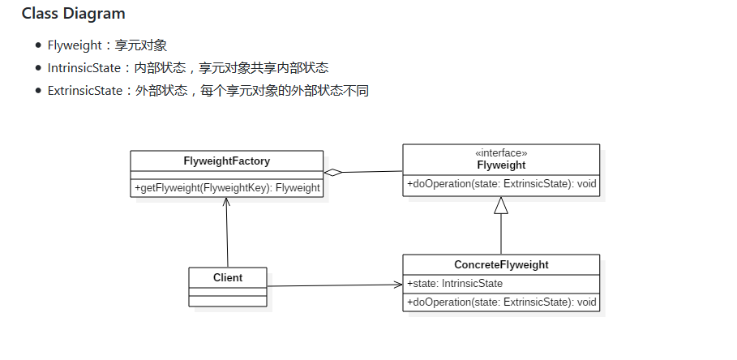

### Java基础
#### 并发与多线程
> https://github.com/CyC2018/CS-Notes/blob/master/notes/Java%20%E5%B9%B6%E5%8F%91.md#semaphore

##### 中断
* 通过调用一个线程的 interrupt() 来中断该线程，如果该线程处于阻塞、限期等待或者无限期等待状态，那么就会抛出 InterruptedException，从而提前结束该线程。但是**不能中断 I/O 阻塞和 synchronized 锁阻塞**。
* 如果一个线程的 run() 方法执行一个无限循环，并且没有执行 sleep() 等会抛出 InterruptedException 的操作，那么调用线程的 interrupt() 方法就无法使线程提前结束。
但是调用 interrupt() 方法会设置线程的中断标记，此时调用 interrupted() 方法会返回 true。因此可以在循环体中使用 interrupted() 方法来判断线程是否处于中断状态，从而提前结束线程。

* 调用 Executor 的 shutdown() 方法会等待线程都执行完毕之后再关闭，但是如果调用的是 shutdownNow() 方法，则相当于调用每个线程的 interrupt() 方法。

##### 锁
* ReentrantLock和synchronized的区别
	1. **锁的实现**：synchronized是jvm实现的，而ReentrantLock是jdk实现
	2. **性能**： 新版本 Java 对 synchronized 进行了很多优化，例如自旋锁等，synchronized 与 ReentrantLock 大致相同。
	3. **等待可中断**：当持有锁的线程长期不释放锁的时候，正在等待的线程可以选择放弃等待，改为处理其他事情。ReentrantLock 以使用thread.interript()中断，而 synchronized 不行。
	4. **公平锁**:synchronized 中的锁是非公平的，ReentrantLock 默认情况下也是非公平的，但是也可以是公平的。
	5. **锁绑定多个条件**:一个 ReentrantLock 可以同时绑定多个 Condition 对象。
> 除非需要使用 ReentrantLock 的高级功能，否则优先使用 synchronized。这是因为 synchronized 是 JVM 实现的一种锁机制，JVM 原生地支持它，而 ReentrantLock 不是所有的 JDK 版本都支持。并且使用 synchronized 不用担心没有释放锁而导致死锁问题，因为 JVM 会确保锁的释放。

* wait() 和 sleep() 的区别
	1. wait() 是 Object 的方法，而 sleep() 是 Thread 的静态方法；
	2. wait() 会释放锁，sleep() 不会。

##### 并发容器
###### BlockingQueue
java.util.concurrent.BlockingQueue 接口有以下阻塞队列的实现：
1. **FIFO 队列 **:LinkedBlockingQueue、ArrayBlockingQueue（固定长度）
2. **优先级队列**:PriorityBlockingQueue
* 提供了阻塞的**take()** 和**put()**方法：如果队列为空 take() 将阻塞，直到队列中有内容；如果队列为满 put() 将阻塞，直到队列有空闲位置。

##### forkjoin
* 主要用于并行计算中，和 MapReduce 原理类似，都是把大的计算任务拆分成多个小任务并行计算。
* ForkJoin 使用 ForkJoinPool 来启动，它是一个特殊的线程池，线程数量取决于 CPU 核数。
* ForkJoinPool 实现了工作窃取算法来提高 CPU 的利用率。每个线程都维护了一个双端队列，用来存储需要执行的任务。工作窃取算法允许空闲的线程从其它线程的双端队列中窃取一个任务来执行。窃取的任务必须是最晚的任务，避免和队列所属线程发生竞争。

##### java内存模型


>[内存模型三大特性](https://github.com/CyC2018/CS-Notes/blob/master/notes/Java%20%E5%B9%B6%E5%8F%91.md#%E5%86%85%E5%AD%98%E6%A8%A1%E5%9E%8B%E4%B8%89%E5%A4%A7%E7%89%B9%E6%80%A7)

###### 先行发生原则
1.	**单一线程原则**：在一个线程内，在程序前面的操作先行发生于后面的操作
2.	**管程锁定原则**：一个unlock操作先行发生与后面对同一个锁的lock操作。
3.	**volatile变量规则**：对一个volatile变量的写操作先行发生于后面对着变量的读操作。
4.	**线程启动原则**：Thread对象的start()方法调用先行发生于此线程的每一个动作。
5.	**线程加入规则**：Thread对象的结束先行发生于join()方法发挥
6.	**线程中断原则**：对线程interrupt()方法的调用先行发生于被中断线程的代码检测到中断事件的发生，可以通过interrupted()方法检测到是否有中断发生。
7.	**对象终结规则**：一个对象的初始化完成（构造函数执行结束）先行发生于它的finalize()方法的开始
8.	**传递性**：如果操作A先行发生于操作B，操作B先行发生与操作C，那么操作A先行发生与操作C。

###### 锁优化
> https://github.com/CyC2018/CS-Notes/blob/master/notes/Java%20%E5%B9%B6%E5%8F%91.md#%E5%8D%81%E4%BA%8C%E9%94%81%E4%BC%98%E5%8C%96

1. 自旋锁
2. 锁消除
3. 锁粗化
4. 轻量级锁
> 轻量级锁是相对于传统的重量级锁而言，它使用 CAS 操作来避免重量级锁使用互斥量的开销。对于绝大部分的锁，在整个同步周期内都是不存在竞争的，因此也就不需要都使用互斥量进行同步，可以先采用 CAS 操作进行同步，如果 CAS 失败了再改用互斥量进行同步。
当尝试获取一个锁对象时，如果锁对象标记为 0 01，说明锁对象的锁未锁定（unlocked）状态。此时虚拟机在当前线程的虚拟机栈中创建 Lock Record，然后使用 CAS 操作将对象的 Mark Word 更新为 Lock Record 指针。如果 CAS 操作成功了，那么线程就获取了该对象上的锁，并且对象的 Mark Word 的锁标记变为 00，表示该对象处于轻量级锁状态。
如果 CAS 操作失败了，虚拟机首先会检查对象的 Mark Word 是否指向当前线程的虚拟机栈，如果是的话说明当前线程已经拥有了这个锁对象，那就可以直接进入同步块继续执行，否则说明这个锁对象已经被其他线程线程抢占了。如果有两条以上的线程争用同一个锁，那轻量级锁就不再有效，要膨胀为重量级锁。
5. 偏向锁
> 偏向锁的思想是偏向于让第一个获取锁对象的线程，这个线程在之后获取该锁就不再需要进行同步操作，甚至连 CAS 操作也不再需要。
当锁对象第一次被线程获得的时候，进入偏向状态，标记为 1 01。同时使用 CAS 操作将线程 ID 记录到 Mark Word 中，如果 CAS 操作成功，这个线程以后每次进入这个锁相关的同步块就不需要再进行任何同步操作。
当有另外一个线程去尝试获取这个锁对象时，偏向状态就宣告结束，此时撤销偏向（Revoke Bias）后恢复到未锁定状态或者轻量级锁状态。

##### 多线程开发的良好实践
> https://github.com/CyC2018/CS-Notes/blob/master/notes/Java%20%E5%B9%B6%E5%8F%91.md#%E5%8D%81%E4%B8%89%E5%A4%9A%E7%BA%BF%E7%A8%8B%E5%BC%80%E5%8F%91%E8%89%AF%E5%A5%BD%E7%9A%84%E5%AE%9E%E8%B7%B5


#### 虚拟机
#### io和socket
> [inputstream read()方法返回值解释](https://blog.csdn.net/zhaomengszu/article/details/54562056)
> [socket基础](https://www.cnblogs.com/rocomp/p/4790340.html)

* io类图

#### nio
> [nio基础](https://github.com/CyC2018/CS-Notes/blob/master/notes/Java%20IO.md#%E4%B8%83nio)
* 所谓编码就是把字符转换为字节，解码就是把字节重新组合成字符
* nio缓冲区变量
	1. limit：所有对Buffer读写操作都会以limit变量的值作为上限。
	2. position：代表对缓冲区进行读写时，当前游标的位置。
	3. capacity：代表缓冲区的最大容量（一般新建一个缓冲区的时候，limit的值和capacity的值默认是相等的）。

	
* clear()方法**用于写模式**，其作用为清空Buffer中的内容，所谓清空是指写上限与Buffer的真实容量相同，即limit==capacity,同时将当前写位置置为最前端下标为0处。

* rewind()在读写模式下都可用，它单纯的将当前位置置0，同时取消mark标记，仅此而已；也就是说写模式下limit仍保持与Buffer容量相同，只是重头写而已；读模式下limit仍然与rewind()调用之前相同，也就是为flip()调用之前写模式下的position的最后位置，flip()调用后此位置变为了读模式的limit位置，即越界位置

* flip()函数的作用是将**写模式转变为读模式**，即将写模式下的Buffer中内容的最后位置变为读模式下的limit位置，作为读越界位置，同时将当前读位置置为0，表示转换后重头开始读，同时再消除写模式下的mark标记

* NIO 实现了 IO 多路复用中的 Reactor 模型，一个线程 Thread 使用一个**选择器 Selector** 通过轮询的方式去监听多个通道 Channel 上的事件，从而让一个线程就可以处理多个事件。**只有套接字 Channel 才能配置为非阻塞，而 FileChannel 不能，为 FileChannel 配置非阻塞也没有意义。**
* 将通道注册到选择器上
```
ServerSocketChannel ssChannel = ServerSocketChannel.open();
ssChannel.configureBlocking(false);
ssChannel.register(selector, SelectionKey.OP_ACCEPT);
```
> 

* NIO 与普通 I/O 的区别主要有以下两点：
	1. NIO 是非阻塞的；
	2. NIO 面向块，I/O 面向流。


### Spring
#### spring boot
#### spring cloud
* 项目

### 知识点


### 笔记

### 算法


### 设计模式
#### 创建型
##### 简单工厂模式
* 简单工厂模式提供一个对象实例的功能，而无须关心其具体的实现。被创建的实例可以是接口，抽象类，也可以是具体的类。
* 简单工厂模式的核心是：选择实现


##### 工厂方法模式
* 工厂方法模式定义一个用于创建对象的接口，让子类决定实例化哪一个类，Factory Method使一个类的实例化延迟到其子类。

* 工厂方法模式的主要功能是让父类在不知道具体实现的情况下，完成自身的功能调用而具体的实现延迟到子类来实现。
* 工厂方法模式的本质：延迟到子类来选择实现。

##### 抽象工厂模式
* 抽象工厂模式提供一个创建一系列相关或者相互依赖对象的接口，而无需指定它们具体的类。

* 抽象工厂模式的核心：选择产品簇的实现


##### 单例模式
* 单例模式保证一个类仅有一个实例，并提供一个访问它的全局访问点。
* 创建单例模式的方法
	1. 懒汉式
	2. 饿汉式
	3. 懒汉式线程安全变种
	4. 饿汉式线程安全变种
	5. 静态内部类
	6. 双重校验锁
	7. 枚举类型
* 单例模式的本质：控制实例数目

##### 生成器模式
* 将一个复杂对象的构建与它的表示分离，使得同样的构建过程可以创建不同的表示。
* 
* 生成器模式的本质：分离整体构建算法和部件构造。

##### 原型模式
* 用原型实例指定创建对象的种类，并通过拷贝这些原型创建新的对象。

* 原型模式的本质：克隆生成对象

#### 行为型
##### 状态模式
* 状态设计模式允许一个对象在其内部状态改变时改变它的行为。对象看起来似乎修改了它的类。

* 状态模式的本质：根据状态来分离和选择行为。

##### 策略模式
* 定义一系列算法，把他们一个个封装起来，并且使它们可相互替换。策略模式使得算法可独立于使用它的客户而变化。

* 策略模式的本质：分离算法，选择实现

##### 模板设计模式
* 模板方法定义一个操作中的算法的骨架，而将一些步骤延迟到子类中。模板方法使的子类可以不改变一个算法的结构即可重新定义该算法的某些特定步骤。

* 模板方法模式的本质：固定算法骨架

##### 责任链模式
* 使多个对象都有机会处理请求，从而避免请求的发送者和请求者之间的耦合关系。将这些对象连成一条链，并沿着这条链传递该请求，知道有一个对象处理它为止。

* 责任链模式的本质：分离职责，动态组合

##### 中介者模式
* 用一个中介对象来封装一系列的对象交互。中介者使得各对象不需要显式地相互引用，从而使其耦合松散，而且可以独立第改变他们之间的交互。
* 
* 中介者模式的本质：封装交互
* 
##### 观察者模式
* 定义对象间的一种一对多的依赖关系。当一个对象的状态发生改变时，所有依赖于它的对象都得到通知并被自动更新。
* 
* 观察者模式的本质：触发联动

##### 命令模式
* 命令模式将一个请求封装为一个对象，从而使你可用不同的请求对客户进行参数化；对请求或记录请求日志，以及支持可撤销的操作。
* 
* 命令模式的本质：封装请求

##### 迭代器模式
* 提供一种方法顺序访问一个聚合对象中的各个元素，而又不需暴露该对象的内部表示

* 迭代器模式的本质：控制访问聚合对象中的元素

##### 备忘录模式
* 在不破坏封装性的前提下，捕获一个对象的内部状态，并在该对象之外保存这个状态。这样以后就就可将对象恢复到原先保存的状态。

* 备忘录模式的本质：保存和恢复内部状态。

#### 结构型
##### 外观设计模式
* 外观模式为子系统中的一组接口提供一个一致的界面，Facade模式定义了一个高层接口，这个接口使的这一子系统更加容易使用。

* 外观模式的本质：封装交互，简化调用

##### 适配器模式
* 将一个类的接口转换成客户希望的另外一个接口。适配器模式使得原本由于接口不兼容而不能一起工作的那些类可以一起工作。

* 适配器模式本质：转换匹配，复用功能

##### 享元设计模式
* 享元模式运用共享技术有效地支持大量细粒度的对象

* 享元对象的本质：分离与共享。分离的是对象状态中变的部分，共享的是对象中不变的部分。

##### 装饰模式
* 动态地给一个对象添加一些额外的职责。就增加功能来说，装饰模式比生成子类更为灵活。

* 装饰模式的核心：动态组合
* 设计原则：类应该对扩展开放，对修改关闭：也就是添加新功能时不需要修改代码

##### 代理模式
* 代理模式为其他对象提供一种代理以控制对这个对象的访问。

* 代理模式的本质：控制对象访问。

##### 组合模式
* 将对象组合成树型结构以表示“部分-整体”的层次结构。组合模式使的用户对单个对象和组合对象的使用具有一致性。

* 组合对象的本质：统一叶子对象和组合对象


### 项目

### redis 
* redis常用指令
* jedis

### shell

### vue
* [MVVM](https://www.liaoxuefeng.com/wiki/001434446689867b27157e896e74d51a89c25cc8b43bdb3000/001475449022563a6591e6373324d1abd93e0e3fa04397f000)

### js
* ES6异步

### github


### ...
熟悉分布式、缓存、消息、搜索等机制，有分布式系统、集群架构设计和使用经验

消息中间件 搜索引擎 分布式数据库

JIT即时编译器

jdk1.7动态语言支持

netty


